## 一、 编译内存相关

### 1. C++编译过程

编译过程分为四个过程：**预处理（预编译）、编译和优化、汇编和链接**。


**预处理:** 在这个阶段主要是对伪指令和特殊符合进行处理。

```C++
//伪指令主要包括以下四个方面：
(1)宏定义指令，如# define Name TokenString，#undef等,
在处理过程中需要将Name用TokenString替换，但作为字符串常量的Name则不被替换。

(2)条件编译指令，如# ifdef，# ifndef，#else，#elif，#endif等。
这些伪指令的引入使得程序员可以通过定义不同的宏来决定编译程序对哪些代码进行处理。
预编译程序将根据有关的文件，将那些不必要的代码过滤掉。

(3)头文件包含指令，如# include "FileName" 或者# include < FileName> 等。
在头文件中一般用伪指令# define定义了大量的宏（最常见的是字符常量），
同时包含有各种外部符号的声明。采用头文件的目的主要是为了使某些定义可以供多个不同的C源程序使用。
因为在需要用到这些定义的C源程序中，
只需加上一条# include语句即可，而不必再在此文件中将这些定义重复一遍。
预编译程序将把头文件中的定义统统都加入到它所产生的输出文件中，以供编译程序对之进行处理。
如INT_MIN和INT_MAX预编译程序对于在源程序中出现的这些串将用合适的值进行替换。 //特殊符号 
```

**编译、优化阶段**: 经过预编译得到的输出文件中，只有常量；如数字、字符串、变量的定义，以及C语言的关键字，如main, if , else , for , while , { , } , + , - , * , \ 等等。编译程序所要作得工作就是通过词法分析和语法分析，在确认所有的指令都符合语法规则之后，将其翻译成等价的中间代码表示或汇编代码。

**汇编:** 汇编过程实际上指把汇编语言代码翻译成目标机器指令的过程。对于被翻译系统处理的每一个C语言源程序，都将最终经过这一处理而得到相应的目标文件。目标文件中所存放的也就是与源程序等效的目标的机器语言代码。

```C++
目标文件由段组成。通常一个目标文件中至少有两个段：
1) 代码段：该段中所包含的主要是程序的指令。该段一般是可读和可执行的，但一般却不可写。
2) 数据段：主要存放程序中要用到的各种全局变量或静态的数据。一般数据段都是可读，可写，可执行的。
```

**链接:** 汇编程序生成的目标文件，即 .o 文件，并不会立即执行，因为可能会出现：.cpp 文件中的函数引用了另一个 .cpp 文件中定义的符号或者调用了某个库文件中的函数。那链接的目的就是将这些文件对应的目标文件连接成一个整体，从而生成可执行的程序 .exe 文件。

```C++   
链接分为两种：
//静态链接
静态链接：函数和数据被编译进一个二进制文件。在使用静态库的情况下，在编译链接可执行文件时，链接器从库中复制这些函数和数据并把它们和应用程序的其它模块组合起来创建最终的可执行文件。

空间浪费：因为每个可执行程序中对所有需要的目标文件都要有一份副本，所以如果多个程序对同一个目标文件都有依赖，会出现同一个目标文件都在内存存在多个副本；

更新困难：每当库函数的代码修改了，这个时候就需要重新进行编译链接形成可执行程序。

运行速度快：但是静态链接的优点就是，在可执行程序中已经具备了所有执行程序所需要的任何东西，在执行的时候运行速度快。

//动态链接
    动态链接的基本思想是把程序按照模块拆分成各个相对独立部分，在程序运行时才将它们链接在一起形成一个完整的程序，而不是像静态链接一样把所有程序模块都链接成一个单独的可执行文件。

    共享库：就是即使需要每个程序都依赖同一个库，但是该库不会像静态链接那样在内存中存在多分，副本，而是这多个程序在执行时共享同一份副本；

    更新方便：更新时只需要替换原来的目标文件，而无需将所有的程序再重新链接一遍。当程序下一次运行时，新版本的目标文件会被自动加载到内存并且链接起来，程序就完成了升级的目标。
    
    性能损耗：因为把链接推迟到了程序运行时，所以每次执行程序都需要进行链接，所以性能会有一定损失。

静态链接：浪费空间，每个可执行程序都会有目标文件的一个副本，这样如果目标文件进行了更新操作，就需要重新进行编译链接生成可执行程序（更新困难）；优点就是执行的时候运行速度快，因为可执行程序具备了程序运行的所有内容。
动态链接：节省内存、更新方便，但是动态链接是在程序运行时，每次执行都需要链接，相比静态链接会有一定的性能损失。
```

### 2.gcc和g++

GCC编译器对程序的编译分为4个阶段：预处理（预编译）、编译和优化、汇编和链接。GCC的编译器可以将这4个步骤合并成一个。先介绍一个每个步骤都分别做了写什么事儿:

- 预处理：在这个阶段主要做了三件事: 展开头文件 、宏替换 、去掉注释行。
  - 这个阶段需要 GCC 调用预处理器来完成，最终得到的还是源文件，文本格式。
- 编译：这个阶段需要 GCC 调用编译器对文件进行编译，最终得到一个汇编文件。
- 汇编：这个阶段需要 GCC 调用汇编器对文件进行汇编，最终得到一个二进制文件。
- 链接：这个阶段需要 GCC 调用链接器对程序需要调用的库进行链接，最终得到一个可执行的二进制文件。

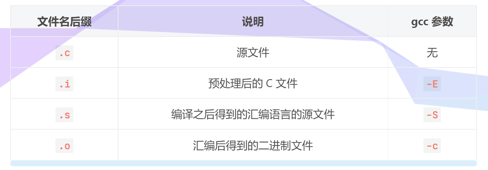
```C++
# 1. 预处理, -o 指定生成的文件名
gcc -E test.c -o test.i

# 2. 编译, 得到汇编文件
$ gcc -S test.i -o test.s

# 3. 汇编
$ gcc -c test.s -o test.o

# 4. 链接  -o指定生成文件名
$ gcc test.o -o test

# 参数 -c 是进行文件的汇编, 汇编之前的两步会自动执行
$ gcc test.c -c -o app.o

# 该命令是直接进行链接生成可执行程序, 链接之前的三步会自动执行
$ gcc test.c -o app    

# -I, 指定头文件目录
$ tree
.
├── add.c
├── div.c
├── include
│   └── head.h
├── main.c
├── mult.c
└── sub.c

# 编译当前目录中的所有源文件，得到可执行程序
$ gcc *.c -o calc
main.c:2:18: fatal error: head.h: No such file or directory
compilation terminated.
sub.c:2:18: fatal error: head.h: No such file or directory
compilation terminated.

# 可以在编译的时候重新指定头文件位置 -I 头文件目录
$ gcc *.c -o calc -I ./include

# 多文件编译  直接编译所有的.c文件即可

```

### 3. C++内存分区
C++ 内存分区：栈、堆、全局/静态存储区、常量存储区、代码区。

- 栈：存放函数的局部变量、函数参数、返回地址等，由编译器自动分配和释放。
- 堆：动态申请的内存空间，就是由 malloc 分配的内存块，由程序员控制它的分配和释放，如果程序执行结束还没有释放，操作系统会自动回收。
- 全局区/静态存储区（.bss 段和 .data 段）：存放全局变量和静态变量，程序运行结束操作系统自动释放，在 C 语言中，未初始化的放在 .bss 段中，初始化的放在 .data 段中，C++ 中不再区分了。
- 常量存储区（.data 段）：存放的是常量，不允许修改，程序运行结束自动释放。
- 代码区（.text 段）：存放代码，不允许修改，但可以执行。编译后的二进制文件存放在这里。
- 阿秀和知乎链接https://www.zhihu.com/collection/619751138还有讲解
  

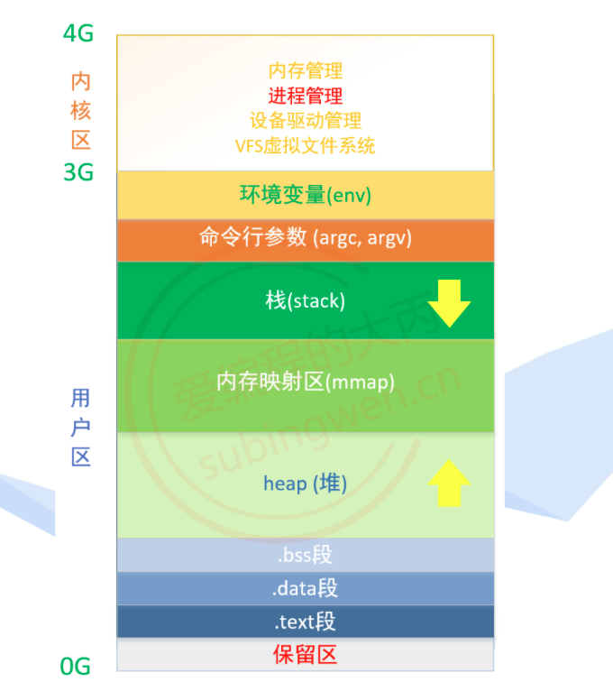

- 保留区：位于虚拟地址空间的最底部，未赋予物理地址。任何对它的引用都是非法的，程序中的空指针（NULL）指向的就是这块内存地址。
- .text段: 代码段也称正文段或文本段，通常用于存放程序的执行代码 (即CPU执行的机器指令)，代码段一般情况下是只读的，这是对执行代码的一种保护机制。
- .data段: 数据段通常用于存放程序中已初始化且初值不为0的全局变量和静态变量和常量。数据段属于静态内存分配 (静态存储区)，可读可写。
- .bss段: 未初始化以及初始为0的全局变量和静态变量，操作系统会将这些未初始化变量初始化为 0
- 堆(heap)：用于存放进程运行时动态分配的内存。
    - 堆中内容是匿名的，不能按名字直接访问，只能通过指针间接访问。
    - 堆向高地址扩展 (即 “向上生长”)，是不连续的内存区域。这是由于系统用链表来存储空闲内存地址，自然不连续，而链表从低地址向高地址遍历。
- 内存映射区(mmap)：作为内存映射区加载磁盘文件，或者加载程序运作过程中需要调用的动态库。
- 栈(stack): 存储函数内部声明的非静态局部变量，函数参数，函数返回地址等信息，栈内存由编译器自动分配释放。栈和堆相反地址 “向下生长”，分配的内存是连续的。
- 命令行参数：存储进程执行的时候传递给 main() 函数的参数，argc，argv []
- 环境变量: 存储和进程相关的环境变量，比如：工作路径，进程所有者等信息


### 4. 堆和栈的区别

- **管理方式不同**：栈是由编译器自动管理,无需我们手工控制;对于堆来说,释放由程序员完成,容易产生内存泄漏。
- **空间大小不同**：一般来讲,在32为系统下面,**堆内存可达到4G的空间**,从这个角度来看堆内存几乎是没有什么限制的。但是对于栈来讲,一般都是有一定空间大小的,例如,在vc6下面,**默认的栈大小好像是1M**。
- **能否产生碎片**：对于堆来讲,频繁的new/delete操作势必会造成内存空间的不连续,从而造成大量的碎片,使程序效率降低。对于栈来讲,则不会存在这问题。 
- **生长方向不同**：对于堆来讲,生长方向是向上的,也就是向着内存地址增加的方向;对于栈来讲,它的生长方式是向下的,是向着内存地址减小的方向增长。 
- **分配方式不同:**  堆都是动态分配的;栈有静态和动态两种分配方式。静态分配由编译器完成,比如局部变量的分配。动态分配由allocator函数进行、但栈的动态分配和堆是不同的,它的动态分配由编译器进行释放,无需我们手工实现。 
- **分配效率不同**：栈是机器系统提供的数据结构,计算机会在底层对栈提供支持:分配专门的寄存器存放栈的地址,压栈出栈都有专门的指令执行,这就决定了栈的效率比较高。堆则是c/C++库函数提供的,机制很复杂。库函数会按照一定的算法进行分配。显然,堆的效率比栈要低得多。 
- 栈在内存中是连续的一块空间（向低地址扩展）最大容量是系统预定好的，堆在内存中的空间（向高地址扩展）是不连续的。
- 存放的内容：栈中存放的是局部变量，函数的参数；堆中存放的内容由程序员控制。
- 数据结构不同：栈的数据结构是一种先进先出的数据结构，堆可以看成是一颗树，如堆排序。

 

### 5. 变量
全局变量、局部变量、静态全局变量、静态局部变量的区别

C++ 变量根据定义的位置的不同的生命周期，具有不同的作用域，作用域可分为 6 种：**全局作用域，局部作用域，语句作用域，类作用域，命名空间作用域和文件作用域。**

- **全局变量**：具有全局作用域。全局变量只需在一个源文件中定义，就可以作用于所有的源文件。**当然，其他不包含全局变量定义的源文件需要用 extern 关键字再次声明这个全局变量。**
- **静态全局变量**：具有文件作用域。它与全局变量的区别在于如果程序包含多个文件的话，**它作用于定义它的文件里，不能作用到其它文件里**，即被 static 关键字修饰过的变量具有文件作用域。这样即使两个不同的源文件都定义了相同名字的静态全局变量，它们也是不同的变量。
- **局部变量**：具有局部作用域。它是自动对象（auto），在程序运行期间不是一直存在，而**是只在函数执行期间存在**，函数的一次调用执行结束后，变量被撤销，其所占用的内存也被收回。
- **静态局部变量**：具有局部作用域。它只被初始化一次，**自从第一次被初始化直到程序运行结束都一直存在**，它和全局变量的区别在于全局变量对所有的函数都是可见的，而**静态局部变量只对定义自己的函数体始终可见**。

注意：全局变量定义在头文件中有什么问题？

- 如果在头文件中定义全局变量，当该头文件被多个文件 `include` 时，该头文件中的全局变量就会被定义多次，导致重复定义，因此不能再头文件中定义全局变量。


### 6 内存对齐
什么是内存对齐？内存对齐的原则？为什么要进行内存对齐，有什么优点？

- 内存对齐：编译器将程序中的每个“数据单元”安排在字的整数倍的地址指向的内存之中。

原则：
- 数据成员对齐规则：结构(struct)(或联合(union))的数据成员，第一个数据成员放在offset为0的地方，以后每个数据成员存储的起始位置要从该成员大小或者成员的子成员大小（只要该成员有子成员，比如说是数组，结构体等）的整数倍开始(比如int在32位机为４字节, 则要从４的整数倍地址开始存储),基本类型不包括struct/uinon/class。
- 结构体作为成员:如果一个结构里有某些结构体成员,则结构体成员要从其内部"最宽基本类型成员"的整数倍地址开始存储.(struct a里存有struct b,b里有char,int ,double等元素,那b应该从8的整数倍开始存储.)。
- 收尾工作:结构体的总大小,也就是sizeof的结果,.必须是其内部最大成员的"最宽基本类型成员"的整数倍.不足的要补齐.(基本类型不包括struct/class/uinon)。
- sizeof(union)，以结构里面size最大元素为union的size,因为在某一时刻，union只有一个成员真正存储于该地址。

```C++
//例1
struct S1{
    char c1;
    char c2;
    int i;
};

S1 a;
sizeof(a) = 8;
```


```C++
//例1
struct S2{
    char c1;
    int i;
    char c2;
};
S2 b;
sizeof(b) = 12;
```


```C++
struct S3{
    double d;
    char c;
    int i;
};    //16字节
struct S4{
    char c1;
    S3 s3;
    double d;
};  // 32字节
//结果是32，我们来看一下分析： 根据上面讲解的容易得出struct S3占16个字节。那我们来看一下struct S4的大小，struct S4中有三个成员变量，第一个char型，占一个字节，对齐到偏移量为0的地址处。第二个成员是结构体嵌套使用，结构体S3变量s3，刚才已经得出占16个字节，而这个结构体的最大元素占字节数为8，所以对齐到偏移量为8的地址空间处。第三个成员是double型，占8个字节，对应到8的整数倍即偏移量24的地址处。结构体总大小是最大对齐数8的整数倍，所以是32。
```


内存对齐的优点：
- 便于在不同的平台之间进行移植，因为有些硬件平台不能够支持任意地址的数据访问，只能在某些地址处取某些特定的数据，否则会抛出异常；
- 提高内存的访问效率，**因为 CPU 在读取内存时，是一块一块的读取。**
- 因为结构体的成员可以有不同的数据类型，所占的大小也不一样。同时，由于CPU读取数据是按块读取的，**内存对齐可以使得CPU一次就可以将所需的数据读进来。**


### 7. 内存泄漏

由于疏忽或错误导致的程序未能释放已经不再使用的内存（无法再访问该内存里面的数据）。

进一步解释：
- 并非指内存从物理上消失，而是指程序在运行过程中，由于疏忽或错误而失去了对该内存的控制，从而造成了内存的浪费。
- 常指堆内存泄漏，因为堆是动态分配的，而且是用户来控制的，如果使用不当，会产生内存泄漏。
- 使用 malloc、new 等分配内存时，使用完后要调用相应的 free 或 delete 释放内存，否则这块内存就会造成内存泄漏。
- 指向堆内存数据的指针被重新赋值

怎样防止内存泄漏？
- 采用内部封装的方式，将内存的分配和释放封装到类中，在构造的时候申请内存，析构的时候释放内存。
- 合理的利用智能指针。
- new和delete以及malloc和free配套使用。

### 8. 智能指针

注意：智能指针不是真正意义上的指针，是一个用来**存储指向动态分配对象的指针**的类。负责自动释放动态分配的对象，防止堆内存泄漏。智能指针在函数结束时会自动释放内存空间，不需要手动释放内存空间，这样就避免了内存泄漏。

1. unique_ptr
   独享所有权的智能指针，**资源只能被一个指针占有，该指针指向的地址不能拷贝构造和赋值给其它指针**。但可以进行移动构造和移动赋值构造（调用 move() 函数），即一个 unique_ptr 对象赋值给另一个 unique_ptr 对象，可以通过该方法进行赋值。
- unique_ptr只能通过move函数转移某个对象的拥有权。
```C++
#include<iostream>
#include<string>
using namespace std;
int main()
{
    int a = 5;
    int* p = new int(5);
    unique_ptr<int> p1(p);
    unique_ptr<int> p2;
    p2=move(p1);//通过move函数将p1的值给p2,p1会变为空指针
    unique_ptr<int> p3 = p1;//提示错误，独占指针无法通过进行拷贝和赋值操作
    return 0;
}
```

2. shared_ptr
	**共享指针（shared_ptr）**：资源可以被多个指针共享，使用计数机制表明资源被几个指针共享。每当多一个指针指向该对象时，指向该对象的所有智能指针内部的引用计数加1，每当减少一个智能指针指向对象时，引用计数会减1，当计数为0的时候会自动的释放动态分配的资源。

- 智能指针将一个计数器与类指向的对象相关联，引用计数器跟踪共有多少个类对象共享同一指针
- 每次创建类的新对象时，初始化指针并将引用计数置为1
- 当对象作为另一对象的副本而创建时，拷贝构造函数拷贝指针并增加与之相应的引用计数
- 对一个对象进行赋值时，赋值操作符减少左操作数所指对象的引用计数（如果引用计数为减至0，则删除对象），并增加右操作数所指对象的引用计数
- 调用析构函数时，构造函数减少引用计数（如果引用计数减至0，则删除基础对象）


3. weak_ptr
**弱指针（weak_ptr）**：指向 `share_ptr` 指向的对象，能够解决由shared_ptr带来的循环引用问题。 需要用shared_ptr或者weak_ptr来构造
shared_ptr的循环引用：以双向链表或只有两个节点的单向循环链表为例，它们各自均定义有一个指向对方的共享指针，造成循环引用。节点1必须等节点2释放后才能释放，节点2必须等节点1释放之后才能释放，导致二者都不能释放。

```C++
namespace SmartPointer{
    class Node{
        public:
            Node(const int& value):pre(NULL), next(NULL), _value(value)
            {
                cout << "Node()" << endl;
            }
            ~Node()
            {
                cout << "~Node()" << endl;
                cout << "this:" << this << endl;
            }
            shared_ptr<Node> pre;//指向双向链表节点的前面一个节点的位置
            shared_ptr<Node> next;//指向双向链表节点的后面一个节点的位置
            int _value;
    };
    void FunTest(){
        shared_ptr<Node> p1(new Node(1));//定义节点1的共享指针
        shared_ptr<Node> p2(new Node(2));//定义节点2的共享指针
        cout<<p1.use_count()<<endl;
        cout<<p2.use_count()<<endl;
        p1->next = p2;//将节点1的下一个位置的节点指向节点2
        p2->pre = p1;//将节点2的上一个位置的节点指向节点1
        cout<<p1.use_count()<<endl;
        cout<<p2.use_count()<<endl;
        // 这两个都没有被释放
    }
// 解决思路  使用一个weak_ptr指向另一个  就可以释放了
    class Node2{
        public:
            Node2(const int& value): next(NULL), _value(value)
            {
                cout << "Node()" << endl;
            }
            ~Node2()
            {
                cout << "~Node()" << endl;
                cout << "this:" << _value << endl;
            }
            weak_ptr<Node2> pre;//指向双向链表节点的前面一个节点的位置
            shared_ptr<Node2> next;//指向双向链表节点的后面一个节点的位置
            int _value;
    }; 

    void FunTest2(){
        shared_ptr<Node2> p1(new Node2(1));//定义节点1的共享指针
        shared_ptr<Node2> p2(new Node2(2));//定义节点2的共享指针
        cout<<p1.use_count()<<endl;
        cout<<p2.use_count()<<endl;
        p1->next = p2;//将节点1的下一个位置的节点指向节点2
        p2->pre = p1;//将节点2的上一个位置的节点指向节点1
        // p1至有一个  p2两个
        // 当退出函数，p1销毁 然后p1所指向的p2销毁  p2计数器减1  p2再销毁 
        cout<<p1.use_count()<<endl;
        cout<<p2.use_count()<<endl;
    }
}
```


**针对这个问题，引进了weak_ptr指针。**


- weak_ptr 是一种不控制对象生命周期的智能指针, 指向一个 shared_ptr 管理的对象。
- weak_ptr 设计的目的是为配合 shared_ptr 而引入的一种智能指针来**协助 shared_ptr 工作**, **它只可以从一个 shared_ptr 或另一个 weak_ptr 对象构造, 它的构造和析构不会引起引用记数的增加或减少。**
- weak_ptr是用来解决shared_ptr相互引用时的死锁问题,**如果说两个shared_ptr相互引用,那么这两个指针的引用计数永远不可能下降为0,资源永远不会释放**，它是对对象的一种弱引用，weak_ptr不会增加对象的引用计数，和shared_ptr之间可以相互转化，shared_ptr可以直接赋值给它
- 不能通过weak_ptr直接访问对象的方法，要先将weak_ptr转化为shared_ptr，它可以通过调用lock函数来获得shared_ptr。
- **std::weak_ptr** 没有 * 运算符和 -> 运算符，所以不能够对资源进行操作，它的唯一作用就是用于检查 std::shared_ptr 是否存在，其 expired() 方法能在资源未被释放时，会返回 false，否则返回 true。

### 9. C++ Prime 关于智能指针的部分

- 对象的生命周期：
  - 全局对象在程序启动时分配，结束时销毁。
  - 局部对象在进入程序块时创建，离开块时销毁。
  - 局部`static`对象在第一次使用前分配，在程序结束时销毁。
  - 动态分配对象：只能显式地被释放。

- 对象的内存位置：
  - **静态内存**用来保存局部`static`对象、类`static`对象、定义在任何函数之外的变量。
  - **栈内存**用来保存定义在函数内的非`static`对象。
  - **堆内存**，又称自由空间，用来存储**动态分配**的对象。

#### 动态内存与智能指针

- 动态内存管理：
  - `new`：在动态内存中为对象分配空间并返回一个指向该对象的指针。
  - `delete`：接受一个动态对象的指针，销毁该对象，并释放与之关联的内存。
- 智能指针：
  - 管理动态对象。
  - 行为类似常规指针。
  - 负责自动释放所指向的对象。
  - 智能指针也是模板。

#### shared_ptr类

**shared_ptr和unique_ptr都支持的操作**：

| 操作 | 解释 |
|-----|-----|
| `shared_ptr<T> sp`  `unique_ptr<T> up` | 空智能指针，可以指向类型是`T`的对象 |
| `p` | 将`p`用作一个条件判断，若`p`指向一个对象，则为`true` |
| `*p` | 解引用`p`，获得它指向的对象。 |
| `p->mem` | 等价于`(*p).mem` |
| `p.get()` | 返回`p`中保存的指针，要小心使用，若智能指针释放了对象，返回的指针所指向的对象也就消失了。 |
| `swap(p, q)` `p.swap(q)` | 交换`p`和`q`中的指针 |

**shared_ptr独有的操作**：

| 操作 | 解释 |
|-----|-----|
| `make_shared<T>(args)` | 返回一个`shared_ptr`，指向一个动态分配的类型为`T`的对象。使用`args`初始化此对象。 |
| `shared_ptr<T>p(q)` | `p`是`shared_ptr q`的拷贝；此操作会**递增**`q`中的计数器。`q`中的指针必须能转换为`T*` |
| `p = q` | `p`和`q`都是`shared_ptr`，所保存的指针必须能互相转换。此操作会**递减**`p`的引用计数，**递增**`q`的引用计数；若`p`的引用计数变为0，则将其管理的原内存释放。 |
| `p.unique()` | 若`p.use_count()`是1，返回`true`；否则返回`false` |
| `p.use_count()` | 返回与`p`共享对象的智能指针数量；可能很慢，主要用于调试。 |

**无论何时拷贝一个shared_ptr,计数器会递增;例如用一个去初始化另一个；作为参数传递给一个函数；作为函数返回值。**
**当我们给一个shared_ptr赋予一个新值时或者shared_ptr被销毁时或一个局部的shared_ptr离开其作用域时，计数器递减**
**shared_ptr的析构函数会递减它所指向的对象的引用计数，若计数变为0，析构函数会销毁对象释放内存**

```C++
// shared_ptr<int> p = make_shared<int>(); //值初始化
auto p = make_shared<int>(42);
auto q(p); //p,q指向两个相同的对象，此对象有两个引用者
//一旦一个shared_ptr<int> 的计数器变为0，他就会自动释放管理的对象
auto r = make_shared<int>(42);// r指向的int只有一个
r=q;//给r赋值mr指向另一个地址
//递增q指向对象的引用计数
//递减r原来指向对象的引用计数
// r指向的对象已经没有引用者，自动释放
```

- **使用动态内存的三种原因**：
  - 程序不知道自己需要使用多少对象（比如容器类）。
  - 程序不知道所需要对象的准确类型。
  - 程序需要在多个对象间共享数据。

#### 直接管理内存

- 用`new`动态分配和初始化对象，默认情况，动态分配的对象是默认初始化的，内置数据类型和组合类型的值未定义而类类型对象将用默认构造函数初始化
  - `new`无法为分配的对象命名（因为自由空间分配的内存是无名的），因此是返回一个指向该对象的指针。
  - `int *pi = new int(123);`
  - 一旦内存耗尽，会抛出类型是`bad_alloc`的异常。
- 用`delete`将动态内存归还给系统。
  - 接受一个指针，指向要释放的对象。
  - `delete`后的指针称为空悬指针（dangling pointer）。
- 使用`new`和`delete`管理动态内存存在三个常见问题：
  - 1.忘记`delete`内存。
  - 2.使用已经释放掉的对象。
  - 3.同一块内存释放两次。
- 如果局部变量被销毁之前没有delete，那么它指向的内存就无法被释放了
- 坚持只使用智能指针可以避免上述所有问题。

```C++
// 默认初始化
string *ps = new string; //
int *pi = new int; //*pi未定义

//直接初始化
string *ps = new string("hello"); //
int *pi = new int(24); // 上述两个 传统构造方式
auto pv = new vector<int>{0,1,2,3,4,5,6};//列表初始化构造类
```

#### shared_ptr和new结合使用

**定义和改变shared_ptr的其他方法**：

| 操作 | 解释 |
|-----|-----|
| `shared_ptr<T> p(q)` | `p`管理内置指针`q`所指向的对象；`q`必须指向`new`分配的内存，且能够转换为`T*`类型 |
| `shared_ptr<T> p(u)` | `p`从`unique_ptr u`那里接管了对象的所有权；将`u`置为空 |
| `shared_ptr<T> p(q, d)` | `p`接管了内置指针`q`所指向的对象的所有权。`q`必须能转换为`T*`类型。`p`将使用可调用对象`d`来代替`delete`。 |
| `shared_ptr<T> p(p2, d)` | `p`是`shared_ptr p2`的拷贝，唯一的区别是`p`将可调用对象`d`来代替`delete`。 |
| `p.reset()` | 若`p`是唯一指向其对象的`shared_ptr`，`reset`会释放此对象。若传递了可选的参数内置指针`q`，会令`p`指向`q`，否则会将`p`置空。若还传递了参数`d`，则会调用`d`而不是`delete`来释放`q`。 |
| `p.reset(q)` | 同上 |
| `p.reset(q, d)` | 同上 |

```C++
shared_ptr<int> p1 = new int(1024);// 错误，不能将内置指针隐式转换为智能指针
shared_ptr<int> p2(new int(1024));// 正确。可以使用直接初始化的方式构造
```

#### 智能指针和异常

- 如果使用智能指针，即使程序块由于异常过早结束，智能指针类也能确保在内存不需要的时候将其释放。
- **智能指针陷阱**：
  - 不用相同的内置指针初始化（或`reset`）多个智能指针
  - 不`delete get()`返回的指针。
  - 如果你使用`get()`返回的指针，记得当最后一个对应的智能指针销毁后，你的指针就无效了。
  - 如果你使用智能指针管理的资源不是`new`分配的内存，记住传递给它一个删除器。

#### unique_ptr

- 某一个时刻只能有一个`unique_ptr`指向一个给定的对象。
- 不支持拷贝或者赋值操作。
- 向后兼容：`auto_ptr`：老版本，具有`unique_ptr`的部分特性。特别是，不能在容器中保存`auto_ptr`，也不能从函数返回`auto_ptr`。

**unique_ptr操作**:

- 一个**unique_ptr**只能指向一个给定的对象，定义一个**unique_ptr**的方式和**shared_ptr**一样

| 操作 | 解释 |
|-----|-----|
| `unique_ptr<T> u1` | 空`unique_ptr`，可以指向类型是`T`的对象。`u1`会使用`delete`来是释放它的指针。 |
| `unique_ptr<T, D> u2` | `u2`会使用一个类型为`D`的可调用对象来释放它的指针。 |
| `unique_ptr<T, D> u(d)` | 空`unique_ptr`，指向类型为`T`的对象，用类型为`D`的对象`d`代替`delete` |
| `u = nullptr` | 释放`u`指向的对象，将`u`置为空。 |
| `u.release()` | `u`放弃对指针的控制权，返回指针，并将`u`置空。 |
| `u.reset()` | 释放`u`指向的对象 |
| `u.reset(q)` | 令`u`指向`q`指向的对象 |
| `u.reset(nullptr)` | 将`u`置空 |

```C++
// 只能直接初始化
unique_ptr<double> p1;
unique_ptr<double> p2(new double(43.0));

unique_ptr<string> p1(new string("danb"));
unique_ptr<string> p2(p1);// 错误，不能拷贝
unique_ptr<string> p3=p1;// 错误，不能拷贝

unique<string> p2(p1.release());//所有权从p1转移给p2,release把p1置为空
unique<string> p3(new string("dan"));
p2.reset(p3.release()); //reset释放了原来p2的内存即danb的内存
```

#### weak_ptr

- `weak_ptr`是一种不控制所指向对象生存期的智能指针。
- 指向一个由`shared_ptr`管理的对象，不改变`shared_ptr`的引用计数。
- 一旦最后一个指向对象的`shared_ptr`被销毁，对象就会被释放，不管有没有`weak_ptr`指向该对象。

**weak_ptr操作**:

| 操作 | 解释 |
|-----|-----|
| `weak_ptr<T> w` | 空`weak_ptr`可以指向类型为`T`的对象 |
| `weak_ptr<T> w(sp)` | 与`shared_ptr`指向相同对象的`weak_ptr`。`T`必须能转换为`sp`指向的类型。 |
| `w = p` | `p`可以是`shared_ptr`或一个`weak_ptr`。赋值后`w`和`p`共享对象。 |
| `w.reset()` | 将`w`置为空。 |
| `w.use_count()` | 与`w`共享对象的`shared_ptr`的数量。 |
| `w.expired()` | 若`w.use_count()`为0，返回`true`，否则返回`false` |
| `w.lock()` | 如果`expired`为`true`，则返回一个空`shared_ptr`；否则返回一个指向`w`的对象的`shared_ptr`。 |

#### 动态数组

##### new和数组

- `new`一个动态数组：
  - 类型名之后加一对方括号，指明分配的对象数目（必须是整型，不必是常量）。
  - 返回**指向第一个对象的指针**。
  - `int *p = new int[size];`

- `delete`一个动态数组：
  - `delete [] p;`

- `unique_ptr`和数组：
  - 指向数组的`unique_ptr`不支持成员访问运算符（点和箭头）。

| 操作 | 解释 |
|-----|-----|
| `unique_ptr<T[]> u` | `u`可以指向一个动态分配的数组，整数元素类型为`T` |
| `unique_ptr<T[]> u(p)` | `u`指向内置指针`p`所指向的动态分配的数组。`p`必须能转换为类型`T*`。 |
| `u[i]` | 返回`u`拥有的数组中位置`i`处的对象。`u`必须指向一个数组。 |

##### allocator类

- 标准库`allocator`类定义在头文件`memory`中，帮助我们将内存分配和对象构造分离开。
- 分配的是原始的、未构造的内存。
- `allocator`是一个模板。
- `allocator<string> alloc;`

**标准库allocator类及其算法**：

| 操作 | 解释 |
|-----|-----|
| `allocator<T> a` | 定义了一个名为`a`的`allocator`对象，它可以为类型为`T`的对象分配内存 |
| `a.allocate(n)` | 分配一段原始的、未构造的内存，保存`n`个类型为`T`的对象。 |
| `a.deallocate(p, n)` | 释放从`T*`指针`p`中地址开始的内存，这块内存保存了`n`个类型为`T`的对象；`p`必须是一个先前由`allocate`返回的指针。且`n`必须是`p`创建时所要求的大小。在调用`deallocate`之前，用户必须对每个在这块内存中创建的对象调用`destroy`。 |
| `a.construct(p, args)` | `p`必须是一个类型是`T*`的指针，指向一块原始内存；`args`被传递给类型为`T`的构造函数，用来在`p`指向的内存中构造一个对象。 |
| `a.destroy(p)` | `p`为`T*`类型的指针，此算法对`p`指向的对象执行析构函数。 |
```C++
allocator<string> a;
auto p = a.allocate(n);
```

**allocator伴随算法**：

| 操作 | 解释 |
|-----|-----|
| `uninitialized_copy(b, e, b2)` | 从迭代器`b`和`e`给定的输入范围中拷贝元素到迭代器`b2`指定的未构造的原始内存中。`b2`指向的内存必须足够大，能够容纳输入序列中元素的拷贝。 |
| `uninitialized_copy_n(b, n, b2)` | 从迭代器`b`指向的元素开始，拷贝`n`个元素到`b2`开始的内存中。 |
| `uninitialized_fill(b, e, t)` | 在迭代器`b`和`e`执行的原始内存范围中创建对象，对象的值均为`t`的拷贝。 |
| `uninitialized_fill_n(b, n, t)` | 从迭代器`b`指向的内存地址开始创建`n`个对象。`b`必须指向足够大的未构造的原始内存，能够容纳给定数量的对象。 |

- 定义在头文件`memory`中。
- 在给定目的位置创建元素，而不是由系统分配内存给他们。

### 10. 静态链接和动态链接

#### 静态库
​	一般扩展名为（.a或.lib）,这类的函数库通常扩展名为libxxx.a或xxx.lib 。
​	**这类库在编译的时候会直接整合到目标程序中**，所以利**用静态函数库编译成的文件会比较大**，这类函数库最大的优点就是编译成功的可执行文件可以**独立运行**，而不再需要向外部要求读取函数库的内容；但是从升级难易度来看明显没有优势，如果函数库更新，需要重新编译。

- 静态库对函数库的链接是放在编译时期完成的，它会将整个库一起打包放到可执行文件（应用程序）当中。
- 程序在运行时与函数库再无瓜葛，移植方便。
- 浪费空间和资源，因为所有相关的目标文件与牵涉到的函数库被链接合成一个可执行文件。
- 但是从升级难易度来看明显没有优势，如果函数库更新，所有的应用程序需要重新编译。

#### 生成静态库的方法
```C++
// 第一步 指定头文件位置生成二进制文件
gcc add.c div.c mult.c sub.c -c -I ./include/

// 第二步：将生成的目标文件通过 ar 工具打包生成静态库
 ar rcs libcalc.a a.o b.o c.o    # a.o b.o c.o在同一个目录中可以写成 *.o
 
// 使用
$ gcc main.c -o app -L ./ -l calc
```

#### 动态库

动态函数库的扩展名一般为（.so或.dll），这类函数库通常名为libxxx.so或xxx.dll 。
​与静态函数库被整个捕捉到程序中不同，动态函数库在编译的时候，**在可执行文件（应用程序）里只有一个“指向”的位置而已**，也就是说当**可执行文件需要使用到函数库的机制时，程序才会去读取函数库来使用**；也就是说**可执行文件无法单独运行**,这样从产品功能升级角度方便升级，只要替换对应动态库即可，不必重新编译整个可执行文件。

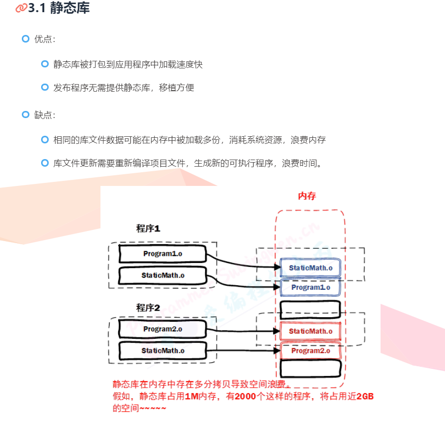
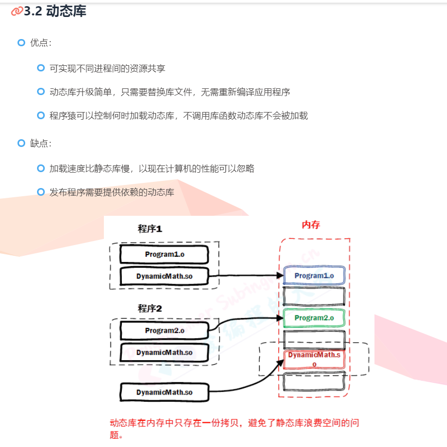

静态库和动态库最本质的区别就是：该库**是否被编译进目标程序内部**,静态库编译的时候整合到目标程序里面，内存里面可以能多分拷贝，而动态库编译的时候可执行文件按只有一个指向的位置，运行到对应部分才会去读取，内存里面只有一份。

#### 动态库制作
```C++
// 将源文件进行汇编操作，需要使用参数 -c, 还需要添加额外参数 -fpic /-fPIC
# 得到若干个 .o文件
$ gcc 源文件(*.c) -c -fpic

// 将得到的.o 文件打包成动态库，还是使用 gcc, 使用参数 -shared 指定生成动态库 (位置没有要求）
$ gcc -shared 与位置无关的目标文件(*.o) -o 动态库(libxxx.so)

//  发布动态库和头文件
	1. 提供头文件: xxx.h
 	2. 提供动态库: libxxx.so
```

### 11. 栈溢出和栈内存溢出

**何时发生栈内存溢出？**
对于一台服务器而言，每一个用户请求，都会产生一个线程来处理这个请求，每一个线程对应着一个栈，栈会分配内存，此时如果请求过多，这时候内存不够了，就会发生栈内存溢出。

**什么时候会发生栈溢出？**
栈溢出是指不断的调用方法，不断的压栈，最终超出了栈允许的栈深度，就会发生栈溢出，比如递归操作没有终止，死循环。

帮助记忆：

可以把内存比作是一个大箱子，栈是一个小箱子，栈溢出是指小箱子装不下了；而栈内存溢出是大箱子在也装不下小箱子了。

## 二、语言对比

#### 1、C和C++的区别和联系

设计思想上：C++是面向对象的语言，而 C 是面向过程的结构化编程语言

语法上：

- C++具有重载、继承和多态三种特性
- C++相比 C，增加多许多类型安全的功能，比如强制类型转换、
- C++支持范式编程，比如模板类、函数模板等
- C++中new和delete是对内存分配的运算符，取代了C中的malloc和free。

## 三、面向对象

### 1、什么是面向对象？面向对象的三大特性

面向对象：对象是指具体的某一个事物，这些事物的抽象就是类，类中包含数据（成员变量）和动作（成员方法）。

面向对象的三大特性：

- 封装：将具体的实现过程和数据封装成一个函数，只能通过接口进行访问，降低耦合性。
- 继承：子类继承父类的特征和行为，子类有父类的方法或成员变量，子类可以对父类的方法进行重写，增强了类之间的耦合性，但是当父类中的成员变量、成员函数或者类本身被 final 关键字修饰时，修饰的类不能继承，修饰的成员不能重写或修改。
- 派生类访问说明符对派生类的成员和友元能否访问基类成员没啥影响，派生类只能访问基类的protect和public的对象，派生类访问说明符影响的只是用户对基类的访问权限。
- 多态：多态就是不同继承类的对象，对同一消息做出不同的响应，基类的指针或引用绑定到派生类的对象，使得基类指针呈现不同的表现方式。

### 2.重载、重写、隐藏的区别

**重载**：是指同一可访问区内被声明几个具有不同参数列（参数的类型、个数、顺序）的同名函数，根据参数列表确定调用哪个函数，**重载不关心函数返回类型。**

**重写发生在子类和父类之间**：是指派生类中存在重新定义的函数。**函数名、参数列表、返回值类型都必须同基类中被重写的函数一致，只有函数体不同**。派生类调用时会调用派生类的重写函数，不会调用被重写函数。重写的基类中被重写的函数必须有 virtual 修饰。

**隐藏**：是指派生类的函数屏蔽了与其同名的基类函数，主要只要同名函数，不管参数列表是否相同，基类函数都会被隐藏。

**重写和重载的区别：**

- 范围区别：对于类中函数的重载或者重写而言，重载发生在同一个类的内部，重写发生在不同的类之间（子类和父类之间）。
- 参数区别：重载的函数需要与原函数有相同的函数名、不同的参数列表，不关注函数的返回值类型；重写的函数的函数名、参数列表和返回值类型都需要和原函数相同，父类中被重写的函数需要有 virtual 修饰。
- virtual 关键字：重写的函数基类中必须有 virtual关键字的修饰，重载的函数可以有 virtual 关键字的修饰也可以没有。

**隐藏和重写，重载的区别：**

- 范围区别：隐藏与重载范围不同，隐藏发生在不同类中。
- 参数区别：隐藏函数和被隐藏函数参数列表可以相同，也可以不同，但函数名一定相同；当参数不同时，无论类中的函数是否被 virtual 修饰，基类函数都是被隐藏，而不是重写。

## 四、C++关键字

### 1. static

- 修饰局部变量，**改变了局部变量的存储位置（从原来的栈中存放改为静态存储区）及其生命周期（局部静态变量在离开作用域之后，并没有被销毁，而是仍然驻留在内存当中，直到程序结束，只不过我们不能再对它进行访问），但未改变其作用域。**

- static修饰全局变量，**并未改变其存储位置及生命周期，而是改变了其作用域，使当前文件外的源文件无法访问该变量**。

- 修饰普通函数，表明函数的作用范围，仅在定义该函数的文件内才能使用。

- 修饰类的成员变量，利用static修饰类的成员变量时，这个变量会存储在静态存储区，并且这个成员变量属于整个类，不属于某一个特定的对象，而是所有的对象共有，即使不创建不对类进行实例化，也可以访问这个变量的值。（**类中的静态成员变量在类定义之后就必须在类外对其进行初始化**）

- 修饰类的成员函数，所有对象实例共享该函数，该函数中不含this指针，不需要创建任何对象实例就可以访问该函数，但是在 static 函数内不能访问非静态成员，**不可以同时用const和static修饰成员函数**。（C++编译器在实现const的成员函数的时候为了确保该函数不能修改类的实例的状态，会在函数中添加一个隐式的参数const this*。但当一个成员为static的时候，该函数是没有this指针的。也就是说此时const的用法和static是冲突的。）

  **静态成员函数不能访问非静态成员，这是因为静态函数属于类而不是属于整个对象，静态函数中的 member可能都没有分配内存。静态成员函数没有隐含的this自变量。所以，它就无法访问自己类的非静态成员。**

注意：类的静态成员函数只能访问静态成员变量。

- 因为静态函数属于类而不是属于整个对象，静态成员函数在类没有进行实例化之前就可以使用，而只有静态成员变量在类定义之后就会进行初始化，而其它成员变量只有在类进行实例化为某个对象之后才能存在值，此时直接访问就会报错，找不到值。
- 普通成员函数在对象实例化之后，会传入一个默认的指向对象的this指针，它们时通过这个this指针来访问自己的成员变量，而静态成员函数中兵没有this指针。

### 2. const

- 修饰变量，说明该变量不可以被改变；

- 修饰指针，分为指向常量的指针和常量指针；

  ```C++
  const int *p;//指向一个常量的指针，那么这个指针指向的对象不能被修改
  int * const p;//常量指针，这个指针是一个常量，但是这个指针所指向的值可以修改
  小结：如果const位于 *的左侧，则const就是用来修饰指针所指向的变量，即指针指向为常量，指向常量的指针；如果const位于 *的右侧，const就是修饰指针本身，即指针本身是常量，常量指针。
  ```
- 常量引用，经常用于形参类型，即避免了拷贝，又避免了函数对值的修改，程序健壮；

- 修饰成员函数，说明该成员函数内不能修改成员变量。
```C++
//我们得出const修饰普成员函数时,修饰的是this指针(this指针指向的内存空间的值不会发生变化)。
//对于这个函数,其实可以变成const Test *const this; 
void func(int x, int y ) const; 
```

### 3. inline
inline 是一个关键字，可以用于定义内联函数。内联函数，像普通函数一样被调用，但是在调用时并不通过函数调用的机制而是直接在调用点处展开，这样可以大大减少由函数调用带来的开销，从而提高程序的运行效率。
编译器对 inline 函数的处理步骤：

- 将inline函数体复制到函数调用点；

- 为inline函数中的局部变量分配内存空间；

- 把inline函数的输入参数和返回值映射到调用方法的局部变量空间中；

- 如果 inline 函数有多个返回点，将其转变为 inline 函数代码块末尾的分支（使用 GOTO）。

  

- **使用方法**：
1. 类内定义成员函数默认是内联函数
在类内定义成员函数，可以不用在函数头部加 inline 关键字，因为编译器会自动将类内定义的函数（构造函数、析构函数、普通成员函数等）声明为内联函数
2. 类外定义成员函数，若想定义为内联函数，需用关键字声明
当在类内声明函数，在类外定义函数时，如果想将该函数定义为内联函数，则可以在类内声明时不加 inline 关键字，而在类外定义函数时加上 inline 关键字。
```C++
#include <iostream>
using namespace std;

class A{
public:
    int var;
    A(int tmp){ //默认为内联函数
      var = tmp;
    }    
    void fun();//若想把该函数定义为内敛函数，则在类外声明时需要加inline
};

inline void A::fun(){
    cout << var << endl;
}

int main()
{    
    return 0;
}
```
- **内联函数的使用时机**：

内联能提高函数效率，但并不是所有的函数都定义成内联函数！内联是以代码膨胀(复制)为代价，仅仅省去了函数调用的开销，从而提高函数的执行效率。(但是，每一处内联函数的调用都要复制代码，将使程序的总代码量增大，消耗更多的内存空间。同时，如果函数体内出现循环，那么执行函数体内代码的时间要比函数调用的开销大（当出现循环时,一般情况下循环的时间会比函数调用所用的时间多得多,所以内联优化效果不明显,所以不优化))

- **虚函数可以是内联函数么**：

虚函数可以是内联函数，内联是可以修饰虚函数的，但是当**虚函数表现多态性**的时候不能内联。
内联是在**编译器**建议编译器内联（**在编译过程就会完成代码的复制**），而虚函数的多态性在**运行期**，编译器无法知道运行期调用哪个代码，因此虚函数表现为多态性时（运行期）不可以内联。
`inline virtual` 唯一可以内联的时候是：编译器知道所调用的对象是哪个类（如 `Base::who()`），这只有在程序知道具有实际对象而不是对象的指针或引用时才会发生。

### 4. this
**this 指针的作用**：

- this 指针是一个隐含于每一个非静态成员函数中的特殊指针。它指向调用该成员函数的那个对象。一个对象的this指针并不是对象本身的一部分，不会影响sizeof(对象)的结果。

- this作用域是在类内部，当在类的非静态成员函数中访问类的非静态成员的时候，编译器会自动将对象本身的地址作为一个隐含参数传递给函数。也就是说，即使你没有写上this指针，编译器在编译的时候也是加上this的，它作为非静态成员函数的隐含形参，对各成员的访问均通过this进行。

- **当对一个对象调用成员函数时， 编译程序先将对象的地址赋给 this 指针**，然后调用成员函数，每次成员函数存取数据成员时，都隐式使用 this 指针。

### 5. explict
- explicit 修饰构造函数时，可以防止隐式转换和复制初始化
- explicit 修饰转换函数时，可以防止隐式转换，但 按语境转换 除外

```C++
struct B
{
	explicit B(int) {}
	explicit operator bool() const { return true; }
};
int main(){
    B b =3;// 错误；要是不加explict, 先调用含有int的初始化为类 再调用编译器合成的拷贝构造函数进行拷贝初始化；有explict  第一步直接gg
    
}
```
```C++
struct A
{
    A(int) { }
    operator bool() const { return true; }
};
struct B
{
    explicit B(int) {}
    explicit operator bool() const { return true; }
};
void doA(A a) {}
void doB(B b) {}
int main()
{
    A a1(1); // OK：直接初始化
    A a2 = 1; // OK：复制初始化
    A a3{ 1 }; // OK：直接列表初始化
    A a4 = { 1 }; // OK：复制列表初始化
    A a5 = (A)1; // OK：允许 static_cast 的显式转换
    doA(1); // OK：允许从 int 到 A 的隐式转换
    if (a1); // OK：使用转换函数 A::operator bool() 的从 A 到 bool 的隐式转换
    bool a6(a1); // OK：使用转换函数 A::operator bool() 的从 A 到 bool 的隐式转换
    bool a7 = a1; // OK：使用转换函数 A::operator bool() 的从 A 到 bool 的隐式转换
    bool a8 = static_cast<bool>(a1); // OK ：static_cast 进行直接初始化
    B b1(1); // OK：直接初始化
    B b2 = 1; // 错误：被 explicit 修饰构造函数的对象不可以复制初始化
    B b3{ 1 }; // OK：直接列表初始化
    B b4 = { 1 }; // 错误：被 explicit 修饰构造函数的对象不可以复制列表初始化
    B b5 = (B)1; // OK：允许 static_cast 的显式转换
    doB(1); // 错误：被 explicit 修饰构造函数的对象不可以从 int 到 B 的隐式转换
    if (b1); // OK：被 explicit 修饰转换函数 B::operator bool() 的对象可以从 B 到 bool 的按语境转换
    bool b6(b1); // OK：被 explicit 修饰转换函数 B::operator bool() 的对象可以从 B 到 bool 的按语境转换
    bool b7 = b1; // 错误：被 explicit 修饰转换函数 B::operator bool() 的对象不可以隐式转换
    bool b8 = static_cast<bool>(b1); // OK：static_cast 进行直接初始化
	return 0;
}
```

### 6.  extern

extern**是一种“**外部声明**”的关键字，字面意思就是**在此处声明**某种变量或函数，**在外部定义**。

注意：extern声明的变量不能初始化。

extern关键字的主要作用是扩大变量/函数的作用域，使得其它源文件和头文件可以复用同样的变量/函数，也起到类似“分块储存”的作用，划分代码。

```C++
//file1.cpp
#include<iostream>
using namespace std;
extern int count;
int main(){
	cout<<count<<endl;
	return 0;
}
//file2.cpp
int count=3;
```
因为file1使用了在file2中定义的全局变量count，**全局变量也叫外部变量，具有外部链接性**，意思就是可以被外部文件引用。即在一个文件中定义了一个变量，需要在另外一个文件中再次使用时，就需要利用extern进行外部声明。

### 7. friend

友元提供了一种普通函数或者类成员函数访问另一个类中的**私有或保护**成员的机制。

两种形式的友元：
- 友元函数：普通函数对一个访问某个类中的私有或保护成员（在友元函数的参数中必须传入一个对象，通过对象名来访问私有成员）。
- 友元类：类A中的成员函数访问类B中的私有或保护成员（在友元类中同样需要传入一个对象才能访问对象的私有成员）

优点：提高了程序的运行效率。
缺点：破坏了类的封装性和数据的透明性。
总结： - 能访问私有成员 - 破坏封装性 - 友元关系不可传递 - 友元关系的单向性 - 友元声明的形式及数量不受限制

```C++
// 函数做友元
#include <iostream>
#include <string>

using namespace std;

// 房屋类
class Building
{
	// 告诉编译器 laoWang全局函数是 Building类  的好朋友，可以访问Building对象的私有成员
	friend void laoWang1(Building *building);
	friend void laoWang2(Building &building);
	friend void laoWang3(Building building);
public:
	Building()
	{
		m_SittingRoom = "客厅";
		m_BedRoom = "卧室";
	}
	string m_SittingRoom;	// 客厅
private:
	string m_BedRoom;		// 卧室
};

//全局函数
void laoWang1(Building *building)
{
	cout << "隔壁老王 全局函数 正在访问：（地址传递） " << building->m_SittingRoom << endl;

	cout << "隔壁老王 全局函数 正在访问：（地址传递） " << building->m_BedRoom << endl;
}

void laoWang2(Building &building)
{
	cout << "隔壁老王 全局函数 正在访问：（引用传递） " << building.m_SittingRoom << endl;

	cout << "隔壁老王 全局函数 正在访问：（引用传递） " << building.m_BedRoom << endl;
}

void laoWang3(Building building)
{
	cout << "隔壁老王 全局函数 正在访问：（ 值传递 ） " << building.m_SittingRoom << endl;

	cout << "隔壁老王 全局函数 正在访问：（ 值传递 ） " << building.m_BedRoom << endl;
}
void test()
{
	Building building;
	laoWang1(&building);
	laoWang2(building);
	laoWang3(building);
}
int main()
{
	test();
}
```

```C++
// 类做友元
#include <iostream>
#include <string>

using namespace std;

// 类作友元

class Building;
class LaoWang
{
public:
	LaoWang();
	void visit();	//参观函数  访问Building中的属性
	Building * building;
private:
};
// 房屋类
class Building
{
	// 告诉编译器，LaoWang类是Building类的好朋友，可以访问Building类的私有成员
	friend class LaoWang;
public:
	Building();
	string m_SittingRoom;	// 客厅
private:
	string m_BedRoom;		// 卧室
};
// 类外定义成员函数
Building::Building()
{
	m_SittingRoom = "客厅";
	m_BedRoom = "卧室";
}
LaoWang::LaoWang()
{
	// 创建建筑物对象
	building = new Building;
}
void LaoWang::visit()
{
	cout << "隔壁老王LaoWang类正在访问：" << building->m_SittingRoom << endl;
	cout << "隔壁老王LaoWang类正在访问：" << building->m_BedRoom << endl;
}
void test()
{
	LaoWang lw;
	lw.visit();
}
int main()
{
	test();
	return 0;
}
```

### 8. union
联合（union）是一种节省空间的特殊的类，一个 union **可以有多个数据成员，但是在任意时刻只有一个数据成员可以有值。当某个成员被赋值后其他成员变为未定义状态。**

特点：
- 默认访问控制符为 public
- 可以含有构造函数、析构函数
- 不能含有引用类型的成员
- 不能继承自其他类，不能作为基类
- 不能含有虚函数
- 匿名 union 在定义所在作用域可直接访问 union 成员
- 匿名 union 不能包含 protected 成员或 private 成员
- 全局匿名联合必须是静态（static）的

- 聚合类：类成员都是公有的，没有构造函数，没有类内初始值，没有基类，没有虚函数

```C++
union token{
	char cval;
	int ival;
	double dval;
};

union{
	char cval;
	int ival;
	double dval;
};
```

### 9. sizeof
sizeof(对象||型)：求的是内存的大小
- 空类的大小为1；
- sizeof 对数组，得到整个数组所占空间大小。
- sizeof 对指针，得到指针本身所占空间大小。
- 个类中，虚函数本身、成员函数（包括静态与非静态）和静态数据成员都是不占用类对象的存储空间。
- 对于包含虚函数的类，不管有多少个虚函数，只有一个虚指针,vptr的大小。
- 普通继承，派生类继承了所有基类的函数与成员，要按照字节对齐来计算大小。
- 虚函数继承，不管是单继承还是多继承，都是继承了基类的vptr。(32位操作系统4字节，64位操作系统 8字节)！
- 虚继承,继承基类的vptr。
```C++
cout << sizeof(bool) << endl;//1
cout << sizeof(char) << endl;//1
cout << sizeof(short int) << endl;//2
cout << sizeof(int) << endl;//4
cout << sizeof(long long int) << endl;//8
cout << sizeof(float) << endl;//4
cout << sizeof(double) << endl;//8
cout << sizeof(long double) << endl;//16
cout << sizeof(unsigned int) << endl;//4
//函数(函数的大小与其返回值类型有关，无返回值的函数无大小)
void f1(){} //error 错误！无法对void类型使用sizeof
int f2(){} //4
double f3(){}//8
//指针（大小为4字节）
cout<<sizeof(string*)<<endl; // 4
cout<<sizeof(int*)<<endl; // 4
cout<<sizeof(char****)<<endl; // 4
//数组(数组的大小是各维数的乘积*数组元素的大小)
char a[] = "abcdef";
int b[20] = { 3, 4 };
char c[2][3] = { "aa", "bb" };
cout << sizeof(a) << endl; // 7*1
cout << sizeof(b) << endl; // 80=80*4
cout << sizeof(c) << endl; // 6=2*3
cout<<strlen(a)<<endl; // 6
```

字符串的`sizeof`和`strlen`
-  strlen是寻找从指定地址开始，到出现的第一个'\0'(空字符)之间的字符个数，他是在运行阶段执行的
-  sizeof是得到数据的大小，在这里是得到字符串的容量。
-  `sizeof` 的参数可以是类型，也可以是变量；`strlen` 的参数必须是 `char*` 类型的变量。

### 10. define 和 const 的区别

**区别**：
- 编译阶段：define 是在编译预处理阶段进行替换，const 是在编译阶段确定其值。
- 安全性：define 定义的宏常量**没有数据类型，只是进行简单的替换，不会进行类型安全的检查**；const 定义的常量是有类型的，是要进行判断的，可以避免一些低级的错误。
- 内存占用：define 定义的宏常量，在程序中使用多少次就会进行多少次替换，**内存中有多个备份，占用的是代码段的空间；**const 定义的常量占用静态存储区的空间，**程序运行过程中只有一份。**
- 调试：define 定义的宏常量不能调试，因为在预编译阶段就已经进行替换了；const 定义的常量可以进行调试。

const 的优点：
- 有数据类型，在定义式可进行安全性检查。
- 可调试。
- 占用较少的空间。

### 11.  define 和 typedef 的区别

###  12. 宏定义（define）和内联函数（inline）的区别

https://www.cnblogs.com/nufangrensheng/p/3626983.html

- 宏定义可以实现类似于函数的功能，但是它终归不是函数，而宏定义中括弧中的“参数”也不是真的参数，在宏展开的时候对 “参数” 进行的是一对一的替换。

- 内联函数是在编译时展开，而宏在编译预处理时展开；在编译的时候，内联函数直接被嵌入到目标代码中去，而宏只是一个简单的文本替换。
- 内联函数是真正的函数，和普通函数调用的方法一样，在调用点处直接展开，避免了函数的参数压栈操作 ，编译器为所用 inline 函数中的局部变量分配内存空间； 将 inline 函数的的输入参数和返回值映射到调用方法的局部变量空间中；减少了调用的开销。而宏定义编写较为复杂，常需要增加一些括号来避免歧义。
- 宏定义只进行文本替换，不会对参数的类型、语句能否正常编译等进行检查。而内联函数是真正的函数，会对参数的类型、函数体内的语句编写是否正确等进行检查。

**inline 内联函数**

- 特征
  - 当于把内联函数里面的内容写在调用内联函数处； 
  - 相当于不用执行进入函数的步骤，直接执行函数体； 
  - 相当于宏，却比宏多了类型检查，真正具有函数特性；
  -  编译器一般不内联包含循环、递归、switch 等复杂操作的内联函数；
  -  在类声明中定义的函数，除了虚函数的其他函数都会自动隐式地当成内联函数。
- 优缺点:
- 优点:
  - 内联函数同宏函数一样将在被调用处进行代码展开，省去了参数压栈、栈帧开辟与回收，结果返回等，从而提高程序运行速度。
  - 内联函数相比宏函数来说，在代码展开时，会做安全检查或自动类型转换（同普通函数），而宏定义则不会。
  - 在类中声明同时定义的成员函数，自动转化为内联函数，因此内联函数可以访问类的成员变量，宏定义则不能。
  -  内联函数在运行时可调试，而宏定义不可以。


### 13. new和malloc的区别，delete 和 free 的区别
- new 申请空间时，无需指定分配空间的大小，编译器会根据类型自行计算；malloc 在申请空间时，需要确定所申请空间的大小。
- new 申请空间时，返回的类型是对象的指针类型，无需强制类型转换，是类型安全的操作符；**malloc 申请空间时，返回的是 void* 类型，需要进行强制类型的转换，转换为对象类型的指针。**
- new 分配失败时，会抛出 bad_alloc 异常，malloc 分配失败时返回空指针。
- 对于自定义的类型，new 首先调用 operator new() 函数申请空间（底层通过 malloc 实现），然后调用构造函数进行初始化，最后返回自定义类型的指针；delete 首先调用析构函数，然后调用 operator delete() 释放空间（底层通过 free 实现）。**malloc、free 无法进行自定义类型的对象的构造和析构。**
- new 操作符从自由存储区上为对象动态分配内存，而 malloc 函数从堆上动态分配内存。（自由存储区不等于堆）

### malloc 和 new的底层实现
#### malloc的实现

#### new的实现
```C++
Complex *pc=new Complex(1,2);//调用new

new的底层调用过程
//step1:调用operator new(sizeof(Complex)),分配一块内存空间
void *mem=operator new(sizeof(Complex));//获得一个空指针
//step2:将指针转型为Complex类型
pc=static_cast<Complex*>(mem);
//step3:调用类的构造函数进行初始化
pc->Complex::Complex(1,2);

```

```C++
//operator new的源代码,该函数的本质还是调用mallloc
void* __CRTDECL operator new(size_t const size)//返回一个空指针
{
    for (;;)
    {
        if (void* const block = malloc(size))//调用malloc
        {
            return block;//返回的是该指针的起始地址
        }
        if (_callnewh(size) == 0)
        {
            if (size == SIZE_MAX)
            {
                __scrt_throw_std_bad_array_new_length();
            }
            else
            {
                __scrt_throw_std_bad_alloc();
            }
        }
        // The new handler was successful; try to allocate again...
    }
```

### 15 new[]/delete/delete[]

#### delete
- 首先执行该对象所属类的析构函数；
- 进而通过调用 `operator delete` 的标准库函数来释放所占的内存空间。
```C++
Complex *pc=new Complex(1,2);//调用new
delete pc;//调用delete

delete的底层调用过程
//step1:调用析构函数
pc->~Complex();
//step2:调用析构函数之后，再调用opereate delete完成内存的释放
opereate delete（pc）;
···

​```C++
//operator delete的源代码
void __CRTDECL operator delete(void* const block) noexcept
{
    #ifdef _DEBUG
    _free_dbg(block, _UNKNOWN_BLOCK);
    #else
    free(block);/调用free
    #endif
}
```

#### delete 和 delete [] 的区别：
- delete 用来释放单个对象所占的空间，只会调用一次析构函数；
- delete [] 用来释放数组空间，会对数组中的每个成员都调用一次析构函数

```C++
Complex *pca=new Complex[3];//必须有默认构造函数
//唤醒三次构造函数
delete[] pca//调用三次析构函数，先构造的后析构
delete pca//调用1次析构函数，可能会造成内存泄漏 类里面有指针就会 没有指针就不会
```

注意：new[ ]会多开辟出一部分空间来存储对象的个数

如果数组里面的每个成员为一般类型,如(int,double等没有析构函数)，在调用delete的时候不会存在析构函数的调用，利用delete/delete[]都可以达到将整块内存释放的效果。

如果数组里面的每个成员有某个类的实例化,在释放内存的时候必须对每个对象依次调用析构函数，只有利用delete[ ]才能完成整个内存空间的次数，析构函数调用的次数为数组的大小，存放在这个数据块的头部。若利用delete只能调用一次析构函数，可能会造成内存泄漏（析构的对象为最后构造的那一个)。
如果数组里面的成员是类且含有指针 ，那么一定会造成内存泄漏，因为析构函数得负责释放类内申请的动态内存。

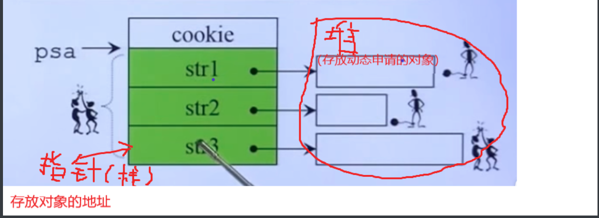
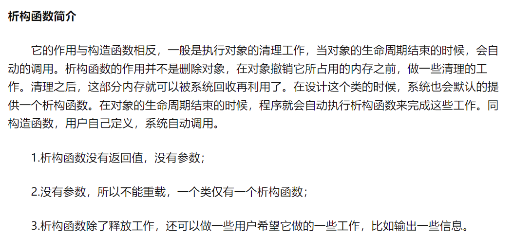

### 16. struct and union

说明：union 是联合体，struct 是结构体。
区别：
- 联合体和结构体都是由若干个数据类型不同的数据成员组成。使用时，联合体只有一个有效的成员；而结构体所有的成员都有效。
- 对联合体的不同成员赋值，会把其他的成员变成未定义的状态，而对于结构体的对不同成员赋值时，相互不影响。
  联合体的大小为其内部所有变量的最大值，按照最大类型的倍数进行分配大小；结构体分配内存的大小遵循内存对齐原则。
  
### 17. void

**void表示“无类型”，void*表示“无类型指针”。**
**void的作用如下：**

- 对函数返回类型的限定，表示函数无返回
- 对函数参数列表的限定，表示函数无参数
```C++
void dispaly(string msg){ //无返回类型
    cout << msg << endl;
}
 
int main(void){  //无参数列表
    string str = "hello";
    display(str);
    return 0;
}
```

void*指针可以用来存放任何类型指针和对象的地址
- 可以将任意类型指针和对象的地址赋予void*，而无需执行强制类型转换。
```C++
void* vp;
int* ip = &obj;
vp = ip;
```

- 若函数可以接受任何类型指针或者返回任何类型的指针，应该讲将其声明为void*。
```C++
void* f(void*){

}
```

### 18. final和override关键字
####  override(指明某个函数为父类中函数的重写)
当在父类中使用虚函数时候，你可能需要在某个子类中对这个虚函数进行重写，以下方法都可以：
```C++
class A
{
	virtual void foo();
}
class B : public A
{
	void foo(); //OK
	virtual void foo(); // OK
	void foo() override; //OK
}
```
如果不使用override，当你手一抖，将foo()写成了f00()会怎么样呢？结果是编译器并不会报错，因为它并不知道你的目的是重写虚函数，而是把它当成了新的函数。如果这个虚函数很重要的话，那就会对整个程序不利。所以，override的作用就出来了，它指定了子类的这个虚函数是重写的父类的，如果你名字不小心打错了的话，编译器是不会编译通过的：
```C++
class A
{
	virtual void foo();
};
class B : public A
{
	virtual void f00(); //OK，这个函数是B新增的，不是继承的
	virtual void f0o() override; //Error, 加了override之后，这个函数一定是继承自A的，A找不到就报错
};
```

#### final (阻止某个类被继承或某个虚函数被重写）

当不希望某个类被继承，或不希望某个虚函数被重写，可以在类名和虚函数后添加final关键字，添加final关键字后被继承或重写，编译器会报错。例子如下：

```C++
class Base
{
	virtual void foo();
};
class A : public Base
{
	void foo() final; // foo 被override并且是最后一个override，在其子类中不可以重写
};
class B final : A // 指明B是不可以被继承的
{
	void foo() override; // Error: 在A中已经被final了
};
class C : B // Error: B is final
{
};
```

### 19. volatile
volatile的意思是“脆弱的”，**表明它修饰的变量的值十分容易被改变**，所**以编译器就不会对这个变量进行优化**（CPU的优化是让该变量存放到CPU寄存器而不是内存），**进而提供稳定的访问**。每次读取volatile的变量时，系统总是会从内存中读取这个变量，并且将它的值立刻保存。

用它定义的变量是多个线程间被多个任务共享的变量，编译器不会把它读进寄存器，而是从内存中重新读取，避免读到的值和实际值不一致。

### 20. extern "C"

具体见linux系统exterc 和https://www.cnblogs.com/skynet/archive/2010/07/10/1774964.html
```C++
extern "C" 包含两个部分，一个是extern，一个是"C"
	extern是一种外部声明的关键字，字面意思就是在此处声明某种变量或函数，在外部定义。
注意：extern声明的变量不能初始化。 
    if(extern int a =1;)
    then:    warning: 'a' initialized and declared 'extern' 应该先定义后赋值
extern关键字的主要作用是扩大变量/函数的作用域，使得其它源文件和头文件可以复用同样的变量/函数，也起到类似“分块储存”的作用，划分代码。
//file1.c:
    int x=1;
    int f(){do something here}
//file2.c:
    extern int x;//在此文件找不到x的定义，会在1文件里面寻找
    int f();
    void g(){x=f();}
回到extern关键字，extern是C/C++语言中表明函数和全局变量作用范围（可见性）的关键字，该关键字告诉编译器，其声明的函数和变量可以在本模块或其它模块中使用。通常，在模块的头文件中对本模块提供给其它模块引用的函数和全局变量以关键字extern声明。例如，如果模块B欲引用该模块A中定义的全局变量和函数时只需包含模块A的头文件即可。这样，模块B中调用模块A中的函数时，在编译阶段，模块B虽然找不到该函数，但是并不会报错；它会在连接阶段中从模块A编译生成的目标代码中找到此函数。
与extern对应的关键字是 static，被它修饰的全局变量和函数只能在本模块中使用


"C"
为了使它们遵守统一规则，可以使用extern指定一个编译和连接规约。例如，声明C和C++标准库函数strcyp()，并指定它应该根据C的编译和连接规约来链接：
extern "C" char* strcpy(char*,const char*);

extern "C"指令非常有用，因为C和C++的近亲关系。注意：extern "C"指令中的C，表示的一种编译和连接规约，而不是一种语言。C表示符合C语言的编译和连接规约的任何语言，如Fortran、assembler等。
还有要说明的是，extern "C"指令仅指定编译和连接规约，但不影响语义。例如在函数声明中，指定了extern "C"，仍然要遵守C++的类型检测、参数转换规则。

如果你有很多语言要加上extern "C"，你可以将它们放到extern "C"{ }中。
//extern "C"的使用要点总结
extern "C" double sqrt(double);//单一语句

extern "C"//复合语句
{
      double sqrt(double);
      int min(int, int);
}

extern "C" //头文件
{
    ＃include <cmath>
}　
/*
不可以将extern "C" 添加在函数内部
*/
```

## 五 类
### 1. 类的大小
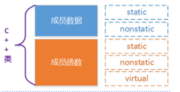

- 与类大小有关的因素：**普通成员变量**，**虚函数**，**继承（虚函数指针，虚基类指针）**
- 与类大小无关的因素：**静态成员变量**，**静态成员函数** ，**普通成员函数**

**空类**
-大小为1
- 空类即什么都没有的类，按上面的说法，照理说大小应该是0，但是**空类的大小为1，因为空类可以实例化，实例化必然在内存中占有一个位置，因此，编译器为其优化为一个字节大小。**
```C++
class base
{
};
class derived:public base
{
 private:
    int a;
}
```
- 注意：当空类作为父类时，它不会在子类中占用任何空间。derived类的大小为4，derived类的大小是自身int成员变量的大小，至于为什么没有加上父类base的大小1是因为空白基优化的问题，在空基类被继承后，子类会优化掉基类的1字节的大小，节省了空间大小，提高了运行效率。

### 2. 一般类的大小
- 注意内存对齐!!!
```C++
class base1
{
private:
    char a;
    int b;
    double c;
};
class base2
{
private:
    char a;
    double b;
    int c;
}
```
虽然上述两个类成员变量都是一个char，一个int，一个double，但是不同的声明顺序，会导致不同的内存构造模型，对于base1，base2
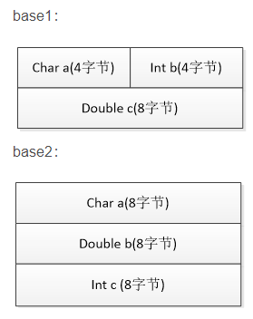

### 3. 含有虚函数的单一类
- 虚函数表vtable在Linux/Unix中存放在可执行文件的只读数据段中(rodata)，是一个类共享的
```C++
class Base//基类
{
private:
    char a;
public:
    virtual void f();
    virtual void g();
};

class Derived:public Base//继承1
{
private:
    int b;
public:
    void f();
};

class Derived1:public Base//继承2
{
private:
    double b;
public:
    void g();
    virtual void h();
};
```
(1) **基类Base**中含有一个char型成员变量，以及两个虚函数，此时Base类的内存布局如下：(**在32位的计算机中，指针占4个字节。同理，在64位的计算机中，指针占8个字节，虚函数指针在最前面**)
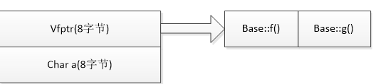
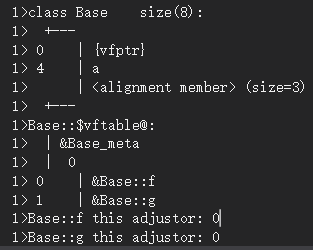
内存布局的最一开始是vfptr（virtual function ptr）即虚函数表指针（只要含虚函数，一定有虚函数表指针，而且该指针一定位于类内存模型最前端），接下来是Base类的成员变量，按照在类里的声明顺序排列，当然啦，还是要像上面一样**注意内存对齐原则！**

(2)  **继承类Derived继承了基类**(父类的成员变量仍然存在)，重写了Base中的虚函数f()，还添加了自己的成员变量，即int型的b，这时，Derived的类内存模型如下
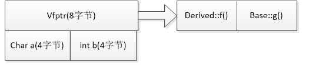
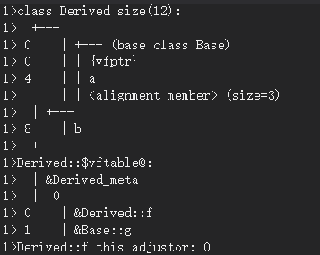
此种情况下，最一开始的还是虚函数表指针，只不过，在Derived类中被重写的虚函数f()在对应的虚函数表项的Base::f()已经被替换为Derived::f()，接下来是基类的成员变量char a，紧接着是继承类的成员变量int b，按照其基类变量声明顺序与继承类变量声明顺序进行排列，并注意内存对齐问题。

（3）**继承类Derived1继承了基类**，重写了Base中的虚函数g()，还添加了自己的成员变量（即double型的b）与自己的虚函数（virtual h() ），这时，Derived1的类内存模型如下：
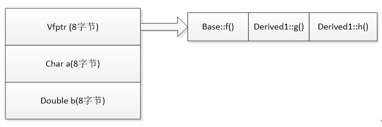
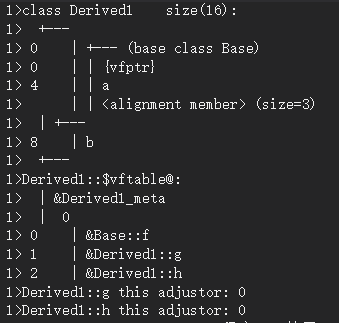

此种情况下，Derived1类一开始仍然是虚函数表指针，只是在Derived1类中被重写的虚函数g()在对应的虚函数表项的Base::g()已经被替换为Derived1::g()，**新添加的虚函数virtual h()位于虚函数表项的后面**，紧跟着基类中最后声明的虚函数表项后，接下来仍然是基类的成员变量，紧接着是继承类的成员变量。

###  4. 含有虚函数的多重继承（会存在多个虚函数表）
```C++
class Base1//基类1
{
private:
    char a;
public:
    virtual void f();
    virtual void g1();
};
class Base2//基类2
{
private:
    int b;
public:
    virtual void f();
    virtual void g2();
};
class Base3//基类3
{
private:
    double c;
public:
    virtual void f();
    virtual void g3();
};
class Derived:public Base1, public Base2, public Base3//多继承
{
private:
    double d;
public:
    void f();
    virtual void derived_func();
};
```
首先继承类多重继承了三个基类，此外继承类重写了三个基类中都有的虚函数virtual f()，还添加了自己特有的虚函数derived_func()，那么，新的继承类内存布局究竟是什么样子的呢？请看下图！先来看3个基类的内存布局：
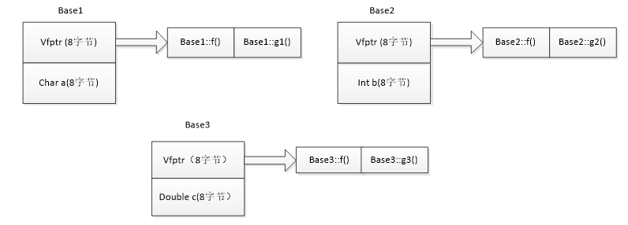
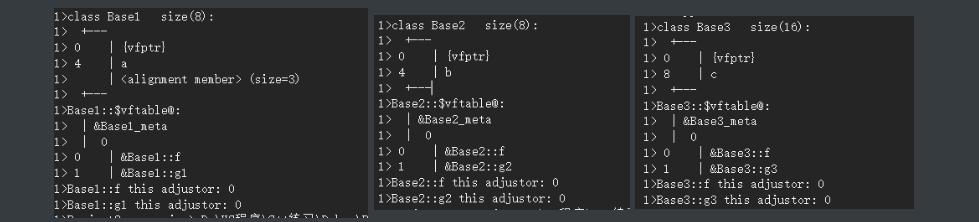

紧接着是继承类Derived的内存布局：

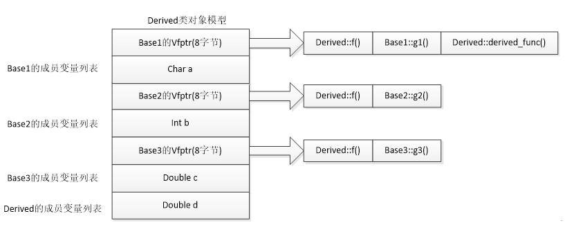
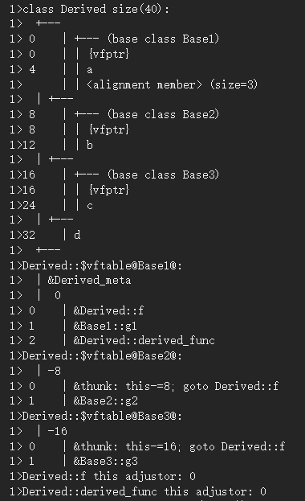

首先，**Derived类自己的虚函数表指针与其声明继承顺序的第一个基类Base1的虚函数表指针合并**，此外，**若Derived类重写了基类中同名的虚函数，则在三个虚函数表的对应项都应该予以修改，**Derived中新添加的虚函数位于第一个虚函数表项后面，Derived中新添加的成员变量位于类的最后面，按其声明顺序与内存对齐原则进行排列。

- 虚函数表属于类的，而不是对象的*(*系统很多对象那不是耗费了很多的内存*)*
- 类和父类都有各自的虚函数表，并且子类的虚函数表继承自父类并做出相应的修改*(*一份拷贝，如何有相同的则覆盖*)*
- 虚函数表指针是属于对象的，创建对象才初始化的，相同类的对象该指针值一样
-  虚函数表在编译器确定，属于常量数据区

### 5. 菱形继承问题以及解决方法
- 通过虚继承（虚基类指针）来解决
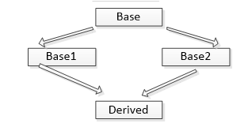
注意：虚拟继承类的大小与编译环境有关。

- 在gcc编译环境下，子类和父类共享虚函数表指针，也就是说父类如果已经有虚函数表指针，那么虚拟继承子类中共享父类的虚函数表指针空间，不再占用额外的空间。
- 在VC编译环境下，如果子类没有添加自己的虚函数，则共享父类的虚函数表指针；如果虚拟继承子类添加了自己的虚函数，则不共享父类虚函数表指针，自己拥有自己的虚函数表指针（**同时父类虚函数指针也会占用子类空间**）。

虚继承时，虚基类指针vbptr指向虚基类表vbtable，**虚基类表中存放的就是数据相对于虚基类指针的偏移，从而根据偏移找到数据**。虚基类表中记录了虚基类与本类的偏移地址；通过偏移地址，这样就找到了虚基类成员，**而虚继承也不用像普通多继承那样维持着公共基类（虚基类）的两份同样的拷贝，节省了存储空间。**
**不含虚函数的虚继承**

```C++
class Base
{
public:
    int a;
}
class Base1:virtual public Base
{
}
class Base2:virtual public Base
{
}
class Derived:public Base1,public Base2
{
private:
    double b;
public:
}
```
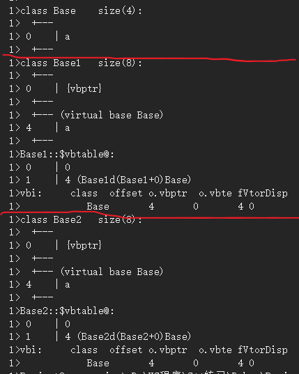
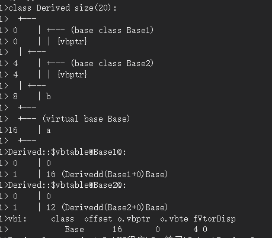

在基类Base中，只包含了一个整形变量a，大小为4，在Base1和Base2中因为采用了虚继承，所以在基类的基础上，Base1和Base2各自添加了一个新的成员变量虚基类指针（vbptr）,所以它们的大小都为8。在Derived类中，继承了Base1和Base2的所有成员（包括它们两个的虚基类指针和它们各自从基类继承的变量a，a只保留一份），再加上它自己大的一个double变量，所以总的大小为20（base1的虚基类指针4+base2的虚基类指针4+它自己成员8+base成员4）。

虚基继承可以使得上述菱形继承情况下最终的Derived类只含有一个Base类，Base类在虚拟继承后，**位于继承类内存布局最后面的位置**，继承类通过vbptr寻找基类中的成员及vfptr。
****

**含有虚函数的虚继承**
虚基继承可以使得上述菱形继承情况下最终的Derived类只含有一个Base类，Base类在虚拟继承后，位于继承类内存布局最后面的位置，继承类通过vbptr（虚基类指针）寻找基类中的成员及vfptr（虚函数表指针）。（Derived的vfptr是从基类继承所得到的）
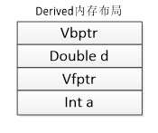

但是如果在虚拟继承过程中，添加了自己的虚函数，那么子类中会产生自己的虚函数指针和虚函数表（Vc编译环境）。
```C++
class base
{
public:
    int a
    virtual void f();
}
class derived:virtual public base
{
public:
    double d;
    void f();
    virtual void g();//这是Derived类自己新添加的虚函数
}
```
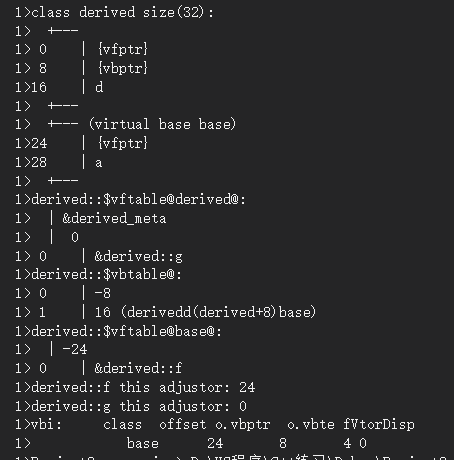
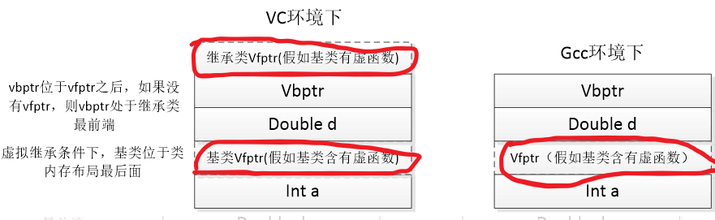
现在有了上述代码的理解我们可以写出菱形虚拟继承代码及每个类的内存布局(VC编译环境下含有虚函数)：
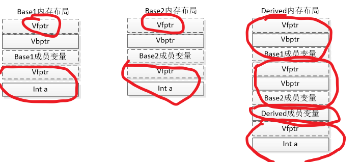

带实线的框是类确确实实有的，带虚线是针对Base，及Base1，Base2做了扩展后的情况：
Base有虚函数，Base1还添加了自己新的虚函数，Base1也有自己成员变量，Base2添加了自己新的虚函数，Base2也有自己成员变量，则上图全部虚线中的部分都将存在于对象内存布局中。


### 6. 虚函数表和虚函数表指针

**虚函数表**：在编译过程中，如果一个类含有虚函数，就会为这个类生成一个虚函数表，虚函数表属于类，类的所有对象共享这个类的虚函数表。（虚函数表是在**编译期间**就已经确定，且**虚函数表存放虚函数的地址也是在创建时被确定**）

**虚函数表指针**：**虚函数表指针随对象走，它发生在对象运行期，当对象创建的时候，虚函数表指针位于该对象所在内存的最前面。** 使用虚函数时，虚函数表指针指向虚函数表中的函数地址即可实现多态。（**虚函数表指针是属于每个对象的数据成员**）

基类的指针或引用导致静态类型和动态类型不一致，才导致了多态。但是我们能够使用的成员仍是由静态对象决定的

```C++
Bulk_quote bulk;
Bulk_quote* bulkp = &bulk;
Quote* item = &bulk;
bulkp->a();//正确
item->a();//错位，item里面没有a
```

### 8. 纯虚函数
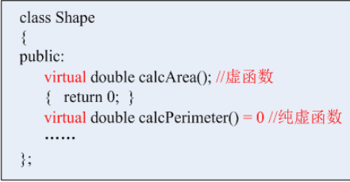
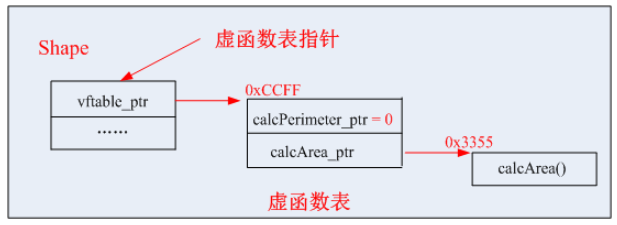

纯虚函数与虚函数一样，都会存放到虚函数表当中，**纯虚函数就是没有函数体，同时在定义的时候，其函数名后面要加上= 0**。

**对于抽象类来说，C++是不允许它去实例化对象的。也就是说，抽象类无法实例化对象**。
**纯虚函数的类为什么不能被实例化：**

可以从纯虚函数的定义来看：virtual void x() = 0;**相当于在虚函数表当中占据了一个位置，但是这个位置又没有存放地址，所以这个虚表就不全，当某人试图创建这个类时(找不到函数地址，就会报错)，**编译器会由于不能安全的创建一个纯抽象类的对象而发出一个出错信息，这样编译器就可以保证抽象类的纯洁性，不会被误用。

（2）引入纯虚函数的原因
为了**方便使用多态特性**，我们常常需要在基类中定义虚函数。

在很多情况下，**基类本身生成对象是不合情理的**。例如，动物作为一个基类可以派生出老虎、孔雀等子类，但动物本身生成对象明显不合常理。（基类作为一个抽象的概念，不允许它进行实例化，只有对它赋予了一定的信息，才能实例化）

为了解决上述问题，引入了纯虚函数的概念，将函数定义为纯虚函数（方法：virtual ReturnType Function()= 0;）。若要使派生类为非抽象类，则编译器要求在派生类中，**必须对纯虚函数予以重写以实现多态性。**同时含有纯虚函数的类称为抽象类，它不能生成对象。这样就很好地解决了上述两个问题。

### 8. 类的成员

如果一个类包括了数据和函数，要为这些函数代码和变量分配存储空间。如果用同一个类定义了10个对象，那么就需要分别为10个对象的数据和函数代码分配存储单元，如下图所示。
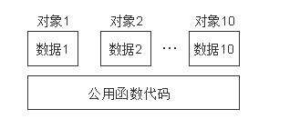

**因此每个对象所占用的存储空间只是该对象的数据部分（虚函数表指针和虚基类指针也属于数据部分）所占用的存储空间，而不包括函数代码所占用的存储空间**。(静态成员变量是整个类的所有对象共有的，不占用每个对象的空间，在类内定义的静态成员变量必须在内外重新定义)

全局数据区存放全局变量，静态数据和常量；所有类成员函数和非成员函数代码存放在代码区；为运行函数而分配的局部变量、函数参数、返回数据、返回地址等存放在栈区；余下的空间都被称为堆区。根据这个解释，我们可以得知在类的定义时，类成员函数是被放在代码区，而**类的静态成员变量在类定义时就已经在全局数据区分配了内存，因而它是属于类的**。对于**非静态成员变量，我们是在类的实例化过程中(构造对象)才在栈区或者堆区为其分配内存**，是为每个对象生成一个拷贝，所以它是属于对象的。

 **静态成员函数和非静态成员函数都是在类的定义时放在内存的代码区的，因而可以说它们都是属于类的**。

a、类为什么只能直接调用静态类成员函数

- 因为静态函数属于类而不是属于整个对象，静态成员函数在类没有进行实例化之前就可以使用，而只有静态成员变量在类定义之后就会进行初始化，而其它成员变量只有在类进行实例化为某个对象之后才能存在值，此时直接访问就会报错，找不到值。
- 普通成员函数在对象实例化之后，在执行成员函数的时候会传入一个默认的指向对象的this指针，它们时通过这个this指针来访问自己的成员变量，而静态成员函数中兵没有this指针。

b、静态成员函数为什么不能访问非静态成员变量

- 非静态成员变量是属于每个对象的，它们只有在类实例化之后才会分配内存空间，它们的访问只能通过该对象本身才能进行调用，而静态成员函数中没有定义指向对象的this指针，所以它不能访问非静态成员变量。

c、非静态成员函数是访问所有的成员变量的（this指针）

-  **this指针在成员函数的开始执行前构造的，在成员的执行结束后清除。**

-  每一个对象都能通过 this 指针来访问自己的地址。**this 指针是所有非静态成员函数的隐含参数。因此，在成员函数内部，它可以用来指向调用对象。**

- this只能在成员函数中使用,成员函数默认第一个参数为**T* const register this**。（友元函数，全局函数不是成员函数）

- 创建一个对象后，不能通过对象使用this指针。也无法知道一个对象的this指针的位置（只有在成员函数里才有this指针的位置）。当然，在成员函数里，你是可以知道this指针的位置的（可以&this获得)，也可以直接使用的。

关于静态成员函数,可以总结为以下几点:

-  出现在类外的函数定义不能指定关键字 static;
-  静态成员之间可以相互访问,包括静态成员函数访问静态数据成员和访问静态成员函数;
-  非静态成员函数可以任意地访问静态成员函数和静态数据成员;
-  静态成员函数不能访问非静态成员函数和非静态数据成员;
-  由于没有 this 指针的额外开销, 因此静态成员函数与类的全局函数相比速度上会有少许的增长;
-  调用静态成员函数,可以用成员访问操作符(.)和(->)为一个类的对象或指向类对象的指针调用静态成员函数;
-  还可以使用类名：：调用静态成员函数

### 9. 为什么构造函数不能是虚函数？

-  构造一个对象的时候，必须知道对象的实际类型，而虚函数行为是在运行期间确定实际类型的。而在构造一个对象时，由于对象还未构造成功。编译器无法知道对象的实际类型，是该类本身，还是该类的一个派生类，或是更深层次的派生类，无法确定。
- **虚函数的执行依赖于虚函数表。而虚函数表在构造函数中进行初始化工作，即初始化vfptr，让他指向正确的虚函数表。而在构造对象期间，虚函数表指针还没有被初始化，将无法进行。**
- 从存储空间的角度考虑：构造函数是在实例化对象的时候进行调用，如果此时将构造函数定义成虚函数，需要通过访问该对象所在的内存空间才能进行虚函数的调用（因为需要通过指向虚函数表的指针调用虚函数表，虽然虚函数表在编译时就有了，但是没有虚函数的指针，虚函数的指针只有在创建了对象才有），但是此时该对象还未创建，便无法进行虚函数的调用。所以构造函数不能定义成虚函数。

### 10. 为什么析构函数可以为虚函数，如果不设为虚函数可能会存在什么问题？

析构函数定义成虚函数是为了防止内存泄漏，因为**当基类的指针或者引用指向或绑定到派生类的对象时**，如果未将基类的析构函数定义成虚函数，会调用基类的析构函数，那么只能将基类的成员所占的空间释放掉，派生类中特有的就会无法释放内存空间导致内存泄漏。

```C++
// 子类B继承自基类A；
A* p = new B;
delete p;

1） 此时，如果类A的析构函数不是虚函数，那么delete p；将会仅仅调用A的析构函数，只释放了B对象中的A部分，而派生出的新的部分未释放掉。
2） 如果类A的析构函数是虚函数，delete p; 将会先调用B的析构函数，再调用A的析构函数，释放B对象的所有空间。
补充： B *p = new B; delete p;时也是先调用B的析构函数，再调用A的析构函数。
```

### 11. 未加虚函数时，子类和父类中同名成员的处理

**未加虚函数时，子类会中的同名成员会屏蔽基类的同名成员，若需要访问父类中的同名成员，需要加类作用域符号。**
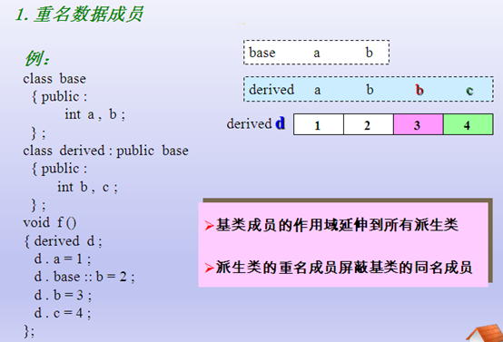
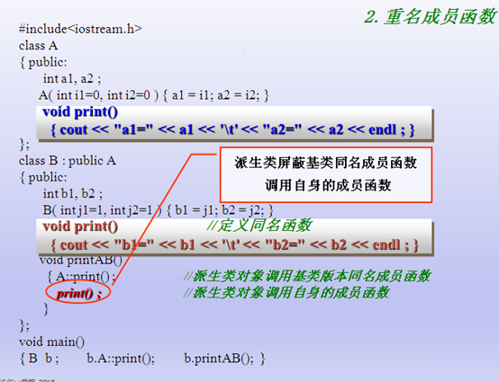

### 12. 类的一些问题
1）什么是虚函数？什么是纯虚函数？

**虚函数**：被 `virtual` 关键字修饰的成员函数，就是虚函数。

**纯虚函数：**

- 纯虚函数在类中声明时，加上 =0；
- 含有纯虚函数的类称为抽象类（只要含有纯虚函数这个类就是抽象类），**类中只有接口，没有具体的实现方法**；
- 继承纯虚函数的派生类，如果没有完全实现基类纯虚函数，依然是抽象类，不能实例化对象。

说明：

- 抽象类对象不能作为函数的参数，不能创建对象，不能作为函数返回类型；
- 可以声明抽象类指针，可以声明抽象类的引用；
- 子类必须继承父类的纯虚函数，并全部实现后，才能创建子类的对象。

（2）虚函数和纯虚函数的区别？

- 虚函数和纯虚函数可以出现在同一个类中，该类称为抽象基类。（含有纯虚函数的类称为抽象基类）
- 使用方式不同：虚函数可以直接使用，纯虚函数必须在派生类中实现后才能使用；
- 定义形式不同：虚函数在定义时在普通函数的基础上加上 virtual 关键字，纯虚函数定义时除了加上virtual 关键字还需要加上 =0;
- 虚函数必须实现，否则编译器会报错；
- 对于实现纯虚函数的派生类，该纯虚函数在派生类中被称为虚函数，虚函数和纯虚函数都可以在派生类中重写；
- 析构函数最好定义为虚函数，特别是对于含有继承关系的类；析构函数可以定义为纯虚函数，此时，其所在的类为抽象基类，不能创建实例化对象。

（3）虚函数的实现机制

**实现机制：**虚函数通过虚函数表来实现，虚函数表保存在全局区的常量数据区。虚函数的地址保存在虚函数表中，在类的对象所在的内存空间中，保存了指向虚函数表的指针（称为“虚表指针”），通过虚表指针可以找到类对应的虚函数表。虚函数表解决了基类和派生类的继承问题和类中成员函数的覆盖问题，当用基类的指针来操作一个派生类的时候，这张虚函数表就指明了实际应该调用的函数。

对于子类和父类它们各自维持着一个自己的虚函数表,子类的虚函数表是从父类继承过来的，不过在子类中对虚函数表进行了一定的修改（添加了自己的虚函数，对父类中的部分虚函数重写，替换为自己的虚函数）

**虚函数表相关知识点：**

- 虚函数表存放的内容：类的虚函数的地址。
- 虚函数表建立的时间：编译阶段，即程序的编译过程中会将虚函数的地址放在虚函数表中。
- 虚表指针保存的位置：虚表指针存放在对象的内存空间中最前面的位置，这是为了保证正确取到虚函数的偏移量。

虚函数表和类绑定，虚表指针和对象绑定。即类的不同的对象的虚函数表是不一样的，但是每个对象都有自己的虚表指针，来指向类的虚函数表。

（4）类的默认构造函数

默认构造函数：未提供任何实参，来控制默认初始化过程的构造函数称为默认构造函数。自己定义了构造函数之后就不会再有默认构造函数了。

（5）如何禁止一个类被实例化？

方法一：

- 在类中定义一个纯虚函数，使该类成为抽象基类，因为不能创建抽象基类的实例化对象；

方法二：

- 将类的构造函数声明为私有 private

（5）深拷贝和浅拷贝的区别

**如果一个类拥有资源，该类的对象进行复制时，如果资源重新分配，就是深拷贝，否则就是浅拷贝。**

- 深拷贝：该对象和原对象占用不同的内存空间，既拷贝存储在栈空间中的内容，又拷贝存储在堆空间中的内容。

  **在对含有指针成员的对象进行拷贝时，必须要自己定义拷贝构造函数，使拷贝后的对象指针成员有自己的内存空间，即进行深拷贝，这样就避免了内存泄漏发生。**

- **浅拷贝：如果没有显示声明一个拷贝构造函数，系统将会自动生成默认拷贝构造函数，默认拷贝构造函数即位拷贝，又称浅拷贝** ，**该对象和原对象占用同一块内存空间**，仅拷贝类中位于栈空间中的内容。

**当类的成员变量中有指针变量时，最好使用深拷贝。因为当两个对象指向同一块内存空间，如果使用浅拷贝，当其中一个对象的删除后，该块内存空间就会被释放，另外一个对象指向的就是垃圾内存。**

- 深拷贝：复制过程中资源重新分配 
- 浅拷贝：资源不重新分配 ----
- 浅拷贝的风险：进行复制过程中，两个对象指向同块内存，当析构函数释放内存时，会引起错误
- 深拷贝和浅拷贝可以简单理解为：如果一个类拥有资源，当这个类的对象发生复制过程的时候，资源重新分配，这个过程就是深拷贝，反之，没有重新分配资源，就是浅拷贝

（6）编译时多态和运行时多态

编译时多态性：注意是通过**函数的重载和操作符的重载来实现**。编译时多态是**指编译器对源程序进行编译**的时候就可以确定所调用的是哪一个函数。　　

运行时多态性：主要是**通过虚函数来实现**。运行时的多态性是指在程序执行前，无法根据函数名和参数确定该调用哪个函数，必须在程序执行过程中，根据执行的具体情况来动态确定。

（7）构造函数或者析构函数中可以调用虚函数吗？

- 从语法上讲，调用完全没有问题。
- 但是从效果上看，往往不能达到需要的目的

派生类对象构造期间进入基类的构造函数时，对**象类型变成了基类类型**，而不是派生类类型。 同样，进入基类析构函数时，**对象也是基类类型**。所有无法达到想要的效果。

（8） 基类的析构函数一般写成虚函数的原因

首先析构函数可以为虚函数，当析构一个指向子类的父类指针时，编译器可以根据虚函数表寻找到子类的析构函数进行调用，从而正确释放子类对象的资源。

如果析构函数不被声明成虚函数，则编译器实施静态绑定，在删除指向子类的父类指针时，只会调用父类的析构函数而不调用子类析构函数，这样就会造成子类对象析构不完全造成内存泄漏。

（9） 构造函数为什么一般不定义为虚函数

1）因为创建一个对象时需要确定对象的类型，而虚函数是在运行时确定其类型的。而在构造一个对象时，**由于对象还未创建成功，编译器无法知道对象的实际类型**，是类本身还是类的派生类等等

2）虚函数的调用需要虚函数表指针，而该指针存放在对象的内存空间中；若构造函数声明为虚函数，那么由于对象还未创建，还没有内存空间，更没有虚函数表地址用来调用虚函数即构造函数了

（10）、在构造函数 和析构函数中可以调用虚函数吗？

答：理论上是可以调用的，但是没有实际意义。

**构造函数和析构函数调用虚函数时都不使用动态联编**，如果在构造函数或析构函数中调用虚函数，则运行的是为构造函数或析构函数自身类型定义的版本

原因分析：

- 不要在构造函数中调用虚函数的原因：因为父类对象会在子类之前进行构造，此时子类部分的数据成员还未初始化， **因此调用子类的虚函数是不安全的**，**故而C++不会进行动态联编**。
- 不要在析构函数中调用虚函数的原因：析构函数是用来销毁一个对象的，**在销毁一个对象时，先调用子类的析构函数，然后再调用基类的析构函数**。所以在调用基类的析构函数时，**派生类对象的数据成员已经“销毁”，这个时再调用子类的虚函数已经没有意义了。**

### 13 . 类的一些解释

**（1）实现多态过程中，只需要将父类的函数定义为虚函数（子类同名函数不需要再定义虚函数），它的作用是产生虚函数指针与虚函数表，然后在子类中对父类的虚函数进行重写，达到替换父类中虚函数表的同名函数地址，最后在实现多态的过程中，就可以直接利用虚函数指针去查询虚函数表（每个对象的虚函数表都不相同，部分父类的虚函数会被子类中的重写函数替换掉，从而在调用过程中就会找到不同的函数，从而实现多态）**

**（2）同时：子类中也可以定义自己的虚函数，这个虚函数的地址也会保存在同样的虚函数表当中。**

**（3）**在实现多重继承过程中，子类会存在多个虚函数表，多个虚函数指针，**Derived类自己的虚函数表指针与其声明继承顺序的第一个基类Base1的虚函数表指针合并**，此外，**若Derived类重写了基类中同名的虚函数，则在三个虚函数表的对应项都应该予以修改，**Derived中新添加的虚函数位于第一个虚函数表项后面，Derived中新添加的成员变量位于类的最后面，按其声明顺序与**内存对齐原则进行排列。**

**(4)**  在实现多态过程中，通过定义一个父类指针来指向子类对象，**如果没有将父类中的同名函数定义为虚函数，则该函数不会添加到虚函数表当中，因此，在后面函数调用过程中**，**无论是哪个子类对象赋值给父类指针，都只会调用父类中的那个函数，无法实现多态。**因为我们所可以使用的成员是由静态类型决定的。

(5)  如在子类中，发生了对父类函数的重写，则通过对象调用时，只会调用对象自己的那个函数，如果需要调用父类的那个函数，需要利用类名+::


## 六 语言特性相关

### 1. 左值和右值的区别？左值引用和右值引用的区别，如何将左值转换成右值(move函数)？

####  左值和右值的区别？
左值指既能够出现在等号左边，也能出现在等号右边的变量；右值则是只能出现在等号右边的变量。
**左值：**指表达式结束后依然存在的**持久对象**，相当于一个变量。
**右值**：表达式结束就不再存在的**临时对象**，例如表达式的值或函数的返回值。

在C++11中所有的值必属于左值、右值两者之一，右值又可以细分为纯右值、将亡值。在C++11中可
以取地址的、有名字的就是左值，反之，不能取地址的、没有名字的就是右值（将亡值或纯右值）

举个例子，`int a = b+c`,` a` 就是左值，其有变量名为`a`，通过`&a`可以获取该变量的地址；表达式`b+c`、函数`int func()`的返回值是右值，在其被赋值给某一变量前，我们不能通过变量名找到它，`＆(b+c)`这样的操作则不会通过编译。

纯右值指的是临时变量和不跟对象关联的字面量值；将亡值则是C++11新增的跟右值引用相关的表达式，这样表达式通常是将要被移动的对象（移为他用），比如返回右值引用T&&的函数返回值、std::move的返回值，或者转换为T&&的类型转换函数的返回值。将亡值可以理解为通过“盗取”其他变量内存空间的方式获取到的值。在确保其他变量不再被使用、或即将被销毁时，通过“盗取”的方式可以避免内存空间的释放和分配，能够延长变量值的生命期。

####  左值引用和右值引用的区别

左值引用就是对一个左值进行引用的类型。右值引用就是对一个右值进行引用的类型，事实上，由于右值通常不具有名字，我们也只能通过引用的方式找到它的存在。右值引用和左值引用都是属于引用类型。无论是声明一个左值引用还是右值引用，都必须立即进行初始化。而其原因可以理解为是引用类型本身自己并不拥有所绑定对象的内存，只是该对象的一个别名。左值引用是具名变量值的别名，而右值引用则是不具名（匿名）变量的别名。左值引用通常也不能绑定到右值，但常量左值引用是个“万能”的引用类型。它可以接受非常量左值、常量左值、右值对其进行初始化。不过常量左值所引用的右值在它的“余生”中只能是只读的。相对地，非常量左值只能接受非常量左值对其进行初始化

**区别**：

- **左值引用不能绑定到要转换的表达式、字面常量或返回右值的表达式（即左值引用的对象必须是一个变量）**。右值引用恰好相反，可以绑定到这类表达式，但不能绑定到一个左值（变量）上。

- 右值引用必须绑定到右值的引用，通过 && 获得。**右值引用只能绑定到一个将要销毁的对象上（即使用后马上就释放，匿名对象），因此可以自由地移动其资源。**

使用右值引用 X&&作为参数的最有用的函数之一就是移动构造函数 X::X(X&& source)，它的主要作用是把源对象的本地资源转移给当前对象。

```C++
int x = 6; // x是左值，6是右值
int &y = x; // 左值引用，y引用x

int &z1 = x * 6; // 错误，x*6是一个右值（要转换的表达式）
const int &z2 =  x * 6; // 正确，可以将一个const引用绑定到一个右值

int &&z3 = x * 6; // 正确，右值引用
int &&z4 = x; // 错误，x是一个左值
```

**有时候，我们可能想转移左值**，也就是说，有时候我们想让编译器把左值当作右值对待，以便能使用转移构造函数，即便这有点不安全。出于这个目的，C++ 11 在标准库的头文件<utility >中提供了一个模板函数 std::move。**实际上，std::move 仅仅是简单地将左值转换为右值，它本身并没有转移任何东西。它仅仅是让对象可以转移。**

```C++
unique_ptr<Shape> a(new Triangle);
unique_ptr<Shape> b(a); // still an error 他的看构造函数仅仅接受右值
unique_ptr<Shape> c(std::move(a)); // okay```
//请注意，第三行之后，a 不再拥有 Triangle 对象。不过这没有关系，因为 通过明确的写出 std::move(a) ，我们很清楚我们的意图：亲爱的转移构造函数，你可以对 a 做任何想要做的事情来初始化 c； 我不再需要 a 了，对于 a，您请自便
```

### 2. std::move()函数的实现原理
```C++
template <typename T>
typename remove_reference<T>::type&& move(T&& t)
{
	return static_cast<typename remove_reference<T>::type &&>(t);
}
```
说明：引用折叠原理
- 右值传递给上述函数的形参 T&& 依然是右值，即 T&& && 相当于 T&&。
- 左值传递给上述函数的形参 T&& 依然是左值，即 T&& & 相当于 T&。
  - 小结：通过引用折叠原理可以知道，move() 函数的形参既可以是左值也可以是右值。

`remove_reference` 具体实现：
```C++
//原始的，最通用的版本
template <typename T> 
struct remove_reference{
    typedef T type;  //定义 T 的类型别名为 type
};
 
//部分版本特例化，将用于左值引用和右值引用
template <class T> 
struct remove_reference<T&> //左值引用
{ typedef T type; }
 
template <class T> 
struct remove_reference<T&&> //右值引用
{ typedef T type; }   
  
//举例如下,下列定义的a、b、c三个变量都是int类型
int i;
remove_refrence<decltype(42)>::type a;             //使用原版本，
remove_refrence<decltype(i)>::type  b;             //左值引用特例版本
remove_refrence<decltype(std::move(i))>::type  b;  //右值引用特例版本 
```

```C++
int var = 10; 

转化过程：
1. std::move(var) => std::move(int&& &) => 折叠后 std::move(int&)

2. 此时：T 的类型为 int&，typename remove_reference<T>::type 为 int，这里使用 remove_reference 的左值引用的特例化版本

3. 通过 static_cast 将 int& 强制转换为 int&&

整个std::move被实例化如下
int&& move(int& t) 
{
    return static_cast<int&&>(t); 
}
```

总结：
std::move() 实现原理：
- 利用引用折叠原理将右值经过 T&& 传递类型保持不变还是右值，而左值经过 T&& 变为普通的左值引用，以保证模板可以传递任意实参，且保持类型不变；
- 然后通过 remove_refrence 移除引用，得到具体的类型 T；
- 最后通过 static_cast<> 进行强制类型转换，返回 T&& 右值引用。

### 3. 指针

对于于32位计算机，指针大小可以是4个字节，对于64位计算机，指针大小可以是8个字节。
主要包括：

- 指向普通对象的指针
- 指向常量对象的指针
- 常量指针  指针本身是常量
- 指向函数的指针：函数指针（  int (*fun_p)(int, int)）
- 指向对象成员的指针，包括指向对象成员函数的指针和指向对象成员变量的指针。
  特别注意：定义指向成员函数的指针时，要标明指针所属的类。
- this 指针：指向类的当前对象的指针常量。
- 指向数组的指针(int (*p)[n])
-   和指针数组(int* p[n])，数组的元素是指针

### 4. 指针和引用的区别

- 指针所指向的内存空间在程序运行过程中可以改变，而引用所绑定的对象一旦绑定就不能改变。（是否可变）
- 指针本身是一个变量，在内存中占有内存空间，引用相当于变量的别名，在内存中不占内存空间。（是否占内存）
- 指针可以被初始化为 NULL，而引用必须被初始化且必须是一个已有对象的引用；
- 使用sizeof查看指针和引用的大小的时候，指针大小是4，引用大小为所引用对象的大小。（sizeof求大小）
- 指针可以有多级，但是引用只能一级。（是否能为多级）
- 指针作为参数过程中，在函数内部可以对指针指向的对象进行有效的修改，而指针本身的值在函数内部的任何操作，在函数结束之后都不会有任何变化。而引用作为函数参数时，对引用的修改直接会改变引用所指向的对象。（作为函数参数）
- 可以有 const 指针，但是没有 const 引用；
- 对指针和引用进行++运算符的意义不一样。（++运算符操作）
- 如果返回动态内存分配的对象或者内存，必须使用指针，引用可能引起内存泄露。

### 5. 野指针和悬空指针

**悬空指针**:
- 若指针指向一块内存空间，当这块内存空间被释放后，该指针依然指向这块内存空间，此时，称该指针为“悬空指针”。
```C++
int main(void) { 
 int * p = nullptr;
 int* p2 = new int;
 p = p2;
 delete p2;
}
//此时 p和p2就是悬空指针，指向的内存已经被释放。继续使用这两个指针，行为不可预料。需要设置为 p=p2=nullptr。此时再使用，编译器会直接保错。
```

**野指针**：

- 野指针是指不确定其指向的指针，未初始化的指针为野指针
**野指针指向了一块随机内存空间，不受程序控制。如指针指向已经被删除的对象或者指向一块没有访问权限的内存空间，之后如果对其再解引用的话，就会出现问题。**
```C++
int main(void) { 
 int* p; // 未初始化
 std::cout<< *p << std::endl; // 未初始化就被使用
 return 0;
}
```

本质：
- 都是是指向无效内存区域(这里的无效指的是"不安全不可控")的指针，访问行为将会导致未定义行为。

### 6. nullptr相较于NULL的优势

NULL：预处理变量，是一个宏，在C和C++中的定义方式不同，在C中定义为（void*）0,表示可以指向任何变量的空指针，但是在C++中，（void *)0无法发生发生隐式转换，NULL被定义为0，此时NULL既可以表示整数，也可以表示指针变量，在它作为函数参数时，会产生二义性。

```C++
#ifdef __cplusplus
#define NULL 0
#else
#define NULL ((void *)0)
#endif
```

```C++
#include <iostream>
using namespace std;
void fun(char* p) {
 cout << "char*" << endl;
}
void fun(int p) {
 cout << "int" << endl;
}
int main()
{
 fun(NULL);
 return 0;
}
//  函数调用会冲突
```
nullptr：C++ 11 中的关键字，是一种特殊类型的字面值，能够隐式的转换为任何指针。被引入用于解决这一问题，nullptr可以明确区分整型和指针类型，能够根据环境自动转换成相应的指针类型，但不会被转换为任何整型，所以不会造成参数传递错误。


### 7. 指向常量的指针和常量指针的区别

**指向常量的指针**：指向常量的指针本质上是个指针，只不过这个指针指向的对象是常量。
特点：const 的位置在指针声明运算符 * 的左侧。只要 const 位于 * 的左侧，无论它在类型名的左边或右边，都表示指向常量的指针。（可以这样理解，* 左侧表示指针指向的对象，该对象为常量，那么该指针为常量指针。）

```C++
const int * p;
int const * p;
```
- 注意 1：指针指向的对象不能通过这个指针来修改，也就是说指向常量的指针可以被赋值为变量的地址，之所以叫做指向常量的指针，是限制了通过这个指针修改变量的值。
- 注意 2：虽然指向常量的指针指向的对象不能变化，可是因为指针本身是一个变量，因此，可以被重新赋值。

**常量指针：**指针本身是一个常量 指针指向不可以变。


特点：const 位于指针声明操作符右侧，表明该对象本身是一个常量，* 左侧表示该指针指向的类型，即以 * 为分界线，其左侧表示指针指向的类型，右侧表示指针本身的性质。

```C++
const int var;
int * const c_p = &var; 
```

- 注意 1：常量的值是指针，这个值因为是常量，所以指针本身不能改变。

- 注意 2：指针的内容可以改变，指针的指向不可以改变。

### 8. 四种cast转换
https://docs.microsoft.com/zh-cn/cpp/cpp/casting-operators?view=msvc-170
（1） const_cast
- 用于将const转换位非const
```C++
// expre_const_cast_Operator.cpp
// compile with: /EHsc
#include <iostream>

using namespace std;
class CCTest {
public:
   void setNumber( int );
   void printNumber() const;
private:
   int number;
};

void CCTest::setNumber( int num ) { number = num; }

void CCTest::printNumber() const {
   cout << "\nBefore: " << number;
   const_cast< CCTest * >( this )->number--;
   cout << "\nAfter: " << number;
}

int main() {
   CCTest X;
   X.setNumber( 8 );
   X.printNumber();
}
```

（2）static_cast
static_cast：用于数据的强制类型转换，强制将一种数据转换为另外一种数据类型。
- 用于基本数据类型的转换。
- 用于**类层次之间的基类和派生类之间的指针或者引用的转换** 不要求必须包含虚函数，但必须是有相互联系的类），进行多态向上转换（派生类的指针或引用转换成基类表示）是安全的；可以进行下行转换（基类的指针或引用转换成派生类表示）由于**没有动态类型检查，但是是不安全的**，最好用 dynamic_cast 进行下行转换。
-  可以将空类型的指针（void*）转换成目标类型的指针。
-  以将**任何类型的表达式**转化成 **void 类型**。

```C++
int main() {
   //运算符 static_cast 还可用于执行任何隐式转换，包括标准转换和用户定义的转换。 例如：
    double *d = static_cast<double*>(&n);  //无关类型转换，编译错误
    // static_cast_Operator_3.cpp
// compile with: /LD /GR
    typedef unsigned char BYTE;

    void f() {
       char ch;
       int i = 65;
       float f = 2.5;
       double dbl;

       ch = static_cast<char>(i);   // int to char
       dbl = static_cast<double>(f);   // float to double
       i = static_cast<BYTE>(ch);
    }
    return 0;
    
    // static_cast_Operator.cpp
    // compile with: /LD
    class B {};
    class D : public B {};
    void f(B* pb, D* pd) {				// 不安全 向下转换 基类转成子类
       D* pd2 = static_cast<D*>(pb);   // Not safe, D can have fields
                                       // and methods that are not in B.
        				  // 安全  向上转换 子类转为基类
       B* pb2 = static_cast<B*>(pd);   // Safe conversion, D always
                                       // contains all of B.
    }
        // static_cast_Operator_2.cpp
    // compile with: /LD /GR
    class B {
    public:
       virtual void Test(){}
    };
    class D : public B {};

    void f(B* pb) {
       D* pd1 = dynamic_cast<D*>(pb);
       D* pd2 = static_cast<D*>(pb);
        // 若pb指向是一个D pd1和pd2获取相同的值 如果pb指向B，而不是完整的D，dynamic_cast知道返回0
        // static_cast 还是返回一个指向D的指针  不一定安全
       // static_cast 向上转换安全 向下不安全
    }
  
}
```

（3）dynamic_cast 仅仅使用于指针或者引用

-  其他三种都是编译时完成的，动态类型转换是在程序运行时处理的，运行时会进行类型检查。它通过判断在执行到该语句的时候变量的运行时类型和要转换的类型是否相同来判断是否能够进行向下转换。
-  用于动态类型转换。只可以用于含义虚函数的类，用于类层次间的向上和向下转换。只能转换指针或者引用。向下转换时，如果是非法的，对于指针返回NULL，对于引用抛出异常。
-  只能用于**带有虚函数的基类或派生类的指针或者引用对象的转换**，这是由于运行时类型检查需要运行时类型信息，而这个信息存储在类的虚函数表中，只有定义了虚函数的类才有虚函数表，没有定义虚函数的类是没有虚函数表的。
-  在向上进行转换时，即派生类类的指针转换成基类类的指针和static_cast 效果是一样的，注意：这里只是改变了指针的类型，指针指向的对象的类型并未发生改变）。

向上转换：指的是子类向基类的转换  
向下转换：指的是基类向子类的转换

```C++
class Base {
public:
    int _i;
    virtual void foo() {}; //基类必须有虚函数。保持多态特性才能使用dynamic_cast
};

class Sub : public Base {
public:
    char *_name[100];
    void Bar() {};
};

int main() {
    Base* pb = new Sub();
    Sub* ps1 = static_cast<Sub*>(pb);  //父类-子类，静态类型转换，正确但不推荐
    Sub* ps2 = dynamic_cast<Sub*>(pb); //父类-子类，动态类型转换，正确

    Base* pb2 = new Base();
    Sub* ps21 = static_cast<Sub*>(pb2); //父类->子类，静态类型转换，危险！访问子类_name成员越界
    Sub* ps22 = dynamic_cast<Sub*>(pb2);//父类->子类，动态类型转换，安全，但结果为NULL，因为pb2是基类指针指向基类对象 因此ps22指向的对象不完整，返回空指针来表示转换失败
    return 0;
}
```

（4）reinterpret_cast
reinterpret_cast：改变指针或引用的类型、将指针或引用转换为一个足够长度的整型、将整型转化为指针或引用类型。(什么都可以转换，比如指针转int，尽量不使用)
```C++
#include <iostream>
using namespace std;

// Returns a hash code based on an address
unsigned short Hash( void *p ) {
   unsigned int val = reinterpret_cast<unsigned int>( p );
   return ( unsigned short )( val ^ (val >> 16));
}

using namespace std;
int main() {
   int a[20];
   for ( int i = 0; i < 20; i++ )
      cout << Hash( a + i ) << endl;
}

Output:
64641
64645
64889
64893
64881
64885
64873
64877
64865
64869
64857
64861
64849
64853
64841
64845
64833
64837
64825
64829
```

### 9. 参数传递时，值传递、引用传递、指针传递的区别？

- 值传递：形参是实参的拷贝，函数对形参的操作不会影响实参。
- 指针传递：本质上是值传递，只不过拷贝的是指针值，拷贝之后，形参和实参是不同的指针，但是指向相同对象，通过指针可以间接访问指针所指的对象，从而可以修改它所指的对象的值。
- 引用传递，当形参是引用类型时，我们说它对应的实参被引用传递。

**在值传递时，形参和实参的地址不一样**，在函数体内操作的不是变量本身。引用传递和指针传递，在函数体内操作的是变量本身。


### 10. 模板及其特例化

模板就是建立通用的模具，大大提高复用性，分为函数模板和类模板。
实现方式：模板定义以关键字`template`开始，后面跟着一个模板参数列表。
- 模板参数列表不可以为空。
- 模板类型参数前必须使用关键字 class 或者 typename，在模板参数列表中这两个关键字含义相同，可互换使用。
```C++
template <typename T, typename U, ...>
```

（1） 函数模板
函数模板：通过定义一个函数模板，可以避免为每一种类型定义一个新函数。

- 对于函数模板而言，模板类型参数可以用来指定返回类型或函数的参数类型，以及在函数体内用于变量声明或类型转换。
- 函数模板实例化：当调用一个模板时，编译器用函数实参来推断模板实参，从而使用实参的类型来绑定到模板的参数类型。

```C++
template <typename T>
T add_fun(const T & tmp1, const T & tmp2){
    return tmp1 + tmp2;
}
```
（2） 类模板
类模板：类似函数模板，以关键字`template`开始，后面跟模板参数列表。但是编译器不能为类模板推断模板参数类型，需要在使用的时候，在模板名后面的尖括号指定类型。
```C++
#include <iostream>
using namespace std;
template <typename T>
class Complex
{
public:
    //构造函数
    Complex(T a, T b)
    {
        this->a = a;
        this->b = b;
    }
    //运算符重载
    Complex<T> operator+(Complex &c)
    {
        Complex<T> tmp(this->a + c.a, this->b + c.b);
        cout << tmp.a << " " << tmp.b << endl;
        return tmp;
    }
private:
    T a;
    T b;
};

int main()
{
    Complex<int> a(10, 20);
    Complex<int> b(20, 30);
    Complex<int> c = a + b;
    return 0;
}
```

(3) 函数模板和类模板的区别
-  实例化方式不同：函数模板实例化由编译程序在**处理函数调用时自动完成**，类模板实例化需要在程序中**显式指定**。
-  实例化的结果不同：函**数模板实例化后是一个函数**，**类模板实例化后是一个类。**
-  默认参数：类模板在模板参数列表中可以有默认参数。
-  特化：函数模板只能全特化；而类模板可以全特化，也可以偏特化。
调用方式不同：函数模板可以隐式调用，也可以显式调用；类模板只能显式调用。

（4）可变参数模板
可变参数模板：接受可变数目参数的模板函数或模板类。将可变数目的参数被称为参数包，包括**模板参数包**和**函数参数包。**

- 模板参数包：表示零个或多个模板参数；
- 函数参数包：表示零个或多个函数参数。

用省略号来指出一个模板参数或函数参数表示一个包，在模板参数列表中，class... 或 typename...指出接下来的参数表示零个或多个类型的列表；一个类型名后面跟一个省略号表示零个或多个给定类型的参数的列表。当需要知道包中有多少元素时，可以使用 sizeof... 运算符。
```C++
template <typename T, typename... Args> // Args 是模板参数包void foo(const T &t, const Args&... rest); // 可变参数模板，rest 是函数参数包
```

```C++
#include <iostream>
using namespace std;
template <typename T>
void print_fun(const T &t)
{
    cout << t << endl; // 最后一个元素
}

template <typename T, typename... Args>
void print_fun(const T &t, const Args &...args)
{
    cout << t << " ";
    print_fun(args...);
}

int main()
{
    print_fun("Hello", "wolrd", "!");
    return 0;
}
/*运行结果：
Hello wolrd !
说明：可变参数函数通常是递归的，第一个版本的 print_fun 负责终止递归并打印初始调用中的最后一个实参。第二个版本的 print_fun 是可变参数版本，打印绑定到 t 的实参，并用来调用自身来打印函数参数包中的剩余值。
/*
```

（5）模板特化以及特化原因
模板特化的原因：模板并非对任何模板实参都合适，都能实例化，某些情况下，通用模板的定义对特定类型不合适，可能会编译失败，或者得不到正确的结果。因此，当不希望使用模板版本时，可以定义类或者函数模板的一个**特例化版本**。

模板特化：模板参数在某种特定类型下的具体实现。分为函数模板特化和类模板特化

- **函数模板特化**：将函数模板中的全部类型进行特例化，称为函数模板特化。
- **类模板特化**：将类模板中的部分或全部类型进行特例化，称为类模板特化。

特化分为全特化和偏特化：

- 全特化：模板中的模板参数全部特例化。
- 偏特化：模板中的模板参数只确**定了一部分**，剩余部分需要在编译器编译时确定。

说明：要区分下函数重载与函数模板特化。定义函数模板的特化版本，本质上是接管了编译器的工作，为原函数模板定义了一个特殊实例，而不是函数重载，函数模板特化并不影响函数匹配。

```C++
#include <iostream>
#include <cstring>
using namespace std;
//函数模板
template <class T>
bool compare(T t1, T t2)
{
    cout << "通用版本：";
    return t1 == t2;
}

template <> //函数模板特化
bool compare(char *t1, char *t2)
{
    cout << "特化版本：";
    return strcmp(t1, t2) == 0;
}

int main(int argc, char *argv[])
{
    char arr1[] = "hello";
    char arr2[] = "abc";
    cout << compare(123, 123) << endl;
    cout << compare(arr1, arr2) << endl;
    return 0;
}
/*
运行结果：
通用版本：1
特化版本：0
*/
```

### 11.  include<文件名> 和 #include"文件名" 的区别


-  查找文件的位置: include<文件名> 在标准库头文件所在的目录中查找，如果没有，再到当前源文件所在目录下查找；#include"文件名" 在当前源文件所在目录中进行查找，如果没有；再到系统目录中查找 。
-  使用习惯：对于标准库中的头文件常用 include<文件名>，对于自己定义的头文件，常用 #include"文件名"。


### 12. 智能指针内存泄漏情况
见前面循环引用。

### 13. STL里面resize和reserve的区别？

resize：改变当前容器内含有元素的数量
```C++
vector<int> v;
v.resize(len);// 如果v原来的size小于len，那么容器新增（len-size）个元素，元素的默认值为0，
```

reserve：改变当前容器的最大容量（capactiy），他不会生成元素，只是确定这个容器允许放多少个对象，如果reserve(len)的值大于当前的capactiy，那么会重新分配一块内存能够存len个对象，然后把之前的 v.size()个对象拷贝过来，销毁之前的内存。

### 14.  C++类内可以定义引用数据成员吗？
- 可以，但是必需通过构造函数初始值列表对该数据成员进行初始化。

### 15. 如何判断内存泄漏？

内存泄漏通常是由于调用了**malloc/new**等内存申请的操作，但是缺少了对应的free/delete。为了判断内存是否泄露，我们一方面可以使用Linux 环境下的内存泄漏检查工具 **Valgrind**,**另一方面我们在写代码时可以添加内存申请和释放的统计功能，统计当前申请和释放的内存是否一致，以此来判断内存是否泄露。**

### 16. 内存泄漏的分类

- 堆内存泄漏：指的是程序运行中通过malloc或者new等从堆中分配的内存块，使用完之后必须通过调用free或者delete删掉。如果这部分内存没有被释放掉，那么此后这块内存将不被使用，产生堆内存泄漏。

- 系统资源泄漏：主要指程序使用系统分配的资源比如Bitmap,handle ,SOCKET 等没有使用相应的函数释放掉，导致系统资源的浪费，严重可导致系统效能降低，系统运行不稳定。

- 没有将基类的析构函数定义为虚函数。当基类指针指向子类对象时，如果基类的析构函数不是 virtual，那么子类的析构函数将不会被调用，子类的资源没有正确是释放，因此造成内存泄露。

### 17. 程序运行从main函数开始吗？

- 程序在main函数开始之前，已经完成了全局变量的初始化，堆栈初始化和系统I/O。
- main之前完成全局变量的构造，在main之后完成全局变量的析构。
- 另外atexit函数还可以在main函数之后运行，它接受一个函数指针作为参数。


## 七 STL相关

容器 迭代器 仿函数 算法 分配器 配接器是STL的六大组件。

他们之间的关系：分配器给容器分配存储空间，算法通过迭代器获取容器中的内容，仿函数可以协助算法完成各种操作，配接器用来套接适配仿函数。

### 1. 迭代器和指针的区别
**迭代器**：
- 迭代器不是指针，是类模板，表现的像指针。它模拟了指针的一些功能，通过重载指针的一些运算符，比如`->，*，++`等等，封装了指针，是一个可以遍历STL容器内全部或者部分元素的对象。白本质是封装了原生指针，是指针概念的一种提升，提供了比指针更加高级的行为，相当于一种之智能指针。
- 迭代器返回的对象的引用。
- 在设计模式中有一种模式叫迭**代器模式**，简单来说就是提供一种方法，**在不需要暴露某个容器的内部表现形式情况下，使之能依次访问该容器中的各个元素**，这种设计思维在STL中得到了广泛的应用，是STL的关键所在，通过迭代器，容器和算法可以有机的粘合在一起，只要对算法给予不同的迭代器，就可以对不同容器进行相同的操作。

```C++
ite=find(vec.begin(),vec.end(),88);
vec.insert(ite,2,77); //迭代器标记的位置前，插入数据；
cout<<*ite<<endl; //会崩溃，因为迭代器在使用后就释放了，*ite的时候就找不到它的地址了；
//注：迭代器在使用后就释放了，不能再继续使用，但是指针可以！！
```

**指针**：

-  指针能指向函数而迭代器不行，迭代器只能指向容器。**迭代器是指针的抽象和泛化。总之，指针和迭代器是有很大差别的，虽然他们表现的行为相似，但是本质是不一样的！**一个是类模板，一个是存放一个家伙的地址的指针变量。**

### 2. 各个容器的底层数据结构实现

- vector 底层数据结构为数组，支持快速随机访问（与数组不同它可以实现自动扩容）。
- list 底层数据结构为双向链表，支持快速增删。
- deque 底层数据结构为一个中央控制器和多个缓冲区，相当于List和Vector的结合品。
```C++
deque是一个双端队列(double-ended queue)，也是在堆中保存内容的. 它的保存形式如下:
[堆1] --> [堆2] -->[堆3] --> ...
每个堆保存好几个元素,然后堆和堆之间有指针指向,看起来像是list和vector的结合品.
```
- stack 底层一般用list或者deque实现，封闭头部即可，不用vector的原因是因为容量大小有限制，扩容耗时。
- queue 底层一般用list或者deque实现，不用vector的原因是因为需要对两端进行操作，十分耗时。
**stack和queue**是容器适配器，是对容器的再封装。
- priority_queue 优先队列的底层数据结构一般为vector，以heap的处理规则来管理容器的实现。
- set 底层数据结构为红黑树，有序，不重复。
- multiset 底层数据结构为红黑树，有序，可以重复
- unordered_set 底层数据结构为哈希表，无序，不可重复。
- map 底层数据结构为红黑树，（键值有序），不可重复。
- multi_map 底层数据结构为红黑树，（键值有序），可重复。
- unordered_map 底层数据结构为哈希表，键值无需，不可重复。

### 3. vector的实现

vector是一种序列是容器，其数据安排以及操作方式与array非常类似，**二者的唯一区别是对于空间的灵活运用性**。array占用的是静态空间，一旦配置了就不可以改变大小，如果遇到空间不足的情况还要自行创建更大的空间，并手动将数据拷贝到新空间，再把原来的空间释放。vector则使用灵活的动态空间配置，维护一块连续的线性空间，在空间不足时，可以**自动扩展空间容纳新元素，做到按需供给**。**其在扩充空间的过程中仍然需要经历：重新配置空间，移动数据，释放原空间等操作。**

vector的扩容倍数与平台有关，在Win+VS是 1.5倍，在Linux+GCC下是2倍。

（1） 为什么是成倍增长，而不是每次增长一个固定容量呢？ 

假设有N个元素，扩容的增量为K，那么则需要扩容N/K次，第i次就要push_back K*i个元素，那么总的push_back的次数为
$$
\sum_i^{N/K}{K*i=\mathrm{O}\left( N^2 \right)}
$$
均摊到每个元素 那么每个元素就要push_back() N次；

采用指数方式增长，倍增因子为m，那么需要分配O(logN)次，那么第i次push_back的次数为 m^i次，总的push_back次数为
$$
\sum_i^{log\left( N \right)}{m^i=\mathrm{O}\left( \frac{\mathrm{N}*m}{m-1} \right)}
$$
均摊到每个元素，push_back（） 常数次。


（2）为什么是以 2 倍或者 1.5 倍增长，而不是以 3 倍或者 4 倍等增长呢？

空间和时间的权衡。简单来说， 空间分配的多，平摊时间复杂度低，但浪费空间也多。使用k=2增长因子的问题在于，每次扩展的新尺寸必然刚好大于之前分配的总和，也就是说，之前分配的内存空间不可能被使用。这样对内存不友好。最好把增长因子设为(1,2)对比可以发现采用采用成倍方式扩容，可以保证常数的时间复杂度，而增加指定大小的容量只能达到O(n)的时间复杂度，因此，使用成倍的方式扩容。

常来说，指数增长策略表现最佳。假设一个字符串开始为空，然后增长到 1200 字符长度。固定增量增长需要 O(N) 次分配，平均需要对每个字符复制 O(N) 次（这样，如果使用 32 字节增量，将需要 38 次分配，每个字符平均需要 19 次复制）。指数增长需要 O(logN) 次分配，平均只需要为每个字符做 O(1) 次——1 次或 2 次复制，这样，如果使用的倍数为 1.5，将需要 10 次分配，每个字符平均需要 2 次复制。

### 4. list的实现

比于vector的连续线型空间，list显得复杂许多，**但是它的好处在于插入或删除都只作用于一个元素空间**，因此list对空间的运用是十分精准的，**对任何位置元素的插入和删除都是常数时间**。list不能保证节点在存储空间中连续存储，也拥有迭代器，迭代器的“++”、“--”操作对于的是指针的操作，list提供的迭代器类型是双向迭代器：Bidirectional iterators。

### 5. deque的实现

vector是单向开口（尾部）的连续线性空间，deque则是一种双向开口的连续线性空间（分段连续），**虽然vector也可以在头尾进行元素操作，但是其头部操作的效率十分低下（主要是涉及到整体的移动）**

deque和vector的最大差异一个是deque运行在常数时间内对头端进行元素操作（而vector只能在尾端进行常数时间操作），二是 deque没有容量的概念，它是动态地以**分段连续空间组合而成，可以随时增加一段新的空间并链接起来**。

deque虽然也提供随机访问的迭代器，但是其迭代器并不是普通的指针，其复杂程度比vector高很多，因此除非必要，否则一般使用vector而非deque。如果需要对deque排序，可以先将deque中的元素复制到vector中，利用sort对vector排序，再将结果复制回deque。因此deque的最大任务是如何维护这个整体的连续性。

**deque**的各个空间分段管理：


deque内部有一个指针指向map（中央控制器），map是一小块连续空间（map的类型为vector），其中的每个元素称为一个节点node，每个node都是一个指针(表示的是每一个分段的地址)，指向另一段较大的连续空间，称为缓冲区，这里就是deque中实际存放数据的区域，默认大小512bytes（每个缓冲区相当于一个固定大小的vector）。

```C++
deque的迭代器
struct __deque_iterator
{
...
T* cur;//迭代器所指缓冲区当前的元素
T* first;//迭代器所指缓冲区第一个元素
T* last;//迭代器所指缓冲区最后一个元素
map_pointer node;//指向map中的node，每隔node指向一个缓冲区
...
}
```

deque迭代器的“++”、“--”操作是远比vector迭代器繁琐，其主要工作在于**缓冲区边界**，**如何从当前缓冲区跳到另一个缓冲区，**当然deque内部在插入元素时，如果map中node数量全部使用完，且node指向的缓冲区也没有多余的空间，这时会配置新的map（2倍于当前+2的数量）来容纳更多的node，也就是可以指向更多的缓冲区。在deque删除元素时，也提供了元素的析构和空闲缓冲区空间的释放等机制。

### 6. stack和queue的实现

（1）stack
stack是一种先进后出的数据结构，只有一个入口和出口，那就是栈顶，除了获取栈顶元素外，没有其他办法获取到其他内部元素。

stack这种单向开口的数据结构很容易由双向开口的deque和list形成，只需要根据stack的性质对应移除某些接口即可实现。

stack除了默认使用deque作为其底层容器之外，也可以使用双向开口的list，只需要在初始化stack时，将list作为第二个参数即可。由于stack只能操作顶端的元素，因此其内部元素无法被访问，也不提供迭代器。

（2）queue
queue（队列）是一种先进先出（First In First Out）的数据结构，有一个入口和一个出口，分别位于最底端和最顶端，出口元素外，没有其他方法可以获取到内部的其他元素，没有迭代器。

queue这种“先进先出”的数据结构很容易由双向开口的deque和list形成,queue也可以使用list作为底层容器，不具有遍历功能，没有迭代器。

（3） priority_queue

priority_queue，优先队列，是一个拥有权值观念的queue，它跟queue一样是顶部入口，底部出口，在插入元素时，元素并非按照插入次序排列，它会自动根据权值（通常是元素的实值）排列，权值最高，排在最前面，没有迭代器。

### 7. set的实现

set的特性是，所有元素都会根据元素的值自动被排序（默认升序），**set元素的键值就是实值，实值就是键值**，set不允许有两个相同的键值。

set不允许迭代器修改元素的值，其迭代器是一种const_iterators。
标准的STL set以RB-tree（红黑树）作为底层机制，几乎所有的set操作行为都是转调用RB-tree的操作行为，这里补充一下红黑树的特性：

- 每个节点不是红色就是黑色
- 根结点为黑色
- 如果节点为红色，其子节点必为黑
- 任一节点至（NULL）树尾端的任何路径，所含的黑节点数量必相同

### 8. map的实现

map的特性是所有元素会**根据键值进行自动排序**。map中所有的元素都是pair，拥有键值(key)和实值(value)两个部分，并且**不允许元素有相同的key**，一旦**map的key确定了，那么是无法修改的**，但是可以修改这个key对应的value。

### 9. set和map的区别

map里面的元素是一些关键字（key-value）对，关键字起到索引的作用，而值表示索引相关数据。
set的每个元素仅仅包含一个关键字，支持高效的查询操作。

### 10. STL种unordered_map和map的区别和应用场景

map支持键值的自动排序，底层机制是红黑树，红黑树的查询和维护时间复杂度均为$O(logn)$，但是空间占用比较大，因为每个节点要保持父节点、孩子节点及颜色的信息

unordered_map是C++ 11新添加的容器，**底层机制是哈希表，通过hash函数计算元素位置，其查询时间复杂度为O(1)**，**维护时间与bucket桶所维护的list长度有关，但是建立hash表耗时较大**

从两者的底层机制和特点可以看出：**map适用于有序数据的应用场景**，un**ordered_map适用于高效查询的应用场景**。

### 11. hashtable中解决冲突的方法有哪些？

- 线性探测法：使用hash函数计算出的位置如果已经有元素占用了，则向后依次寻找，找到表尾则回到表头，直到找到一个空位。

- 链地址法：链地址法是指把所有的冲突关键字存储在一个线性链表中，这个链表由其散列地址唯一标识。

- 再散列：发生冲突时使用另一种hash函数再计算一个地址，直到不冲突。

### 12. 迭代器：++it和it++哪个好？

-  前置返回一个引用，后置返回一个对象。
-  前置不会产生临时对象，后置必然会产生临时对象，导致效率降低。
```C++
// ++i实现代码为：
int& operator++()
{
*this += 1;
return *this;
}

//i++实现代码为：
int operator++(int)
{
int temp = *this;
++*this;
return temp;
}
```


### 13. vector和list的区别以及应用？怎么找到vector或者list的倒数第二个元素？

（1）vector数据结构

vector和数组类似，**拥有一段连续的内存空间，并且起始地址不变**。因此能**高效的进行随机存取**，时间复杂度为o(1);但因为内存空间是连续的，所以在**进行插入和删除操作时，会造成内存块的拷贝，时间复杂度为o(n)**。另外，当**数组中内存空间不够时，会重新申请一块内存空间并进行内存拷贝**。

连续存储结构：vector是可以实现**动态增长的对象数组**，**支持对数组高效率的访问和在数组尾端的删除和插入操作**，在**中间和头部删除和插入相对不易，需要挪动大量的数据。它与数组最大的区别就是vector不需程序员自己去考虑容量问题，库里面本身已经实现了容量的动态增长，而数组需要程序员手动写入扩容函数进形扩容**。

(2) list数据结构

list是由双向链表实现的，因此内存空间是不连续的。只能通过指针访问数据，所以list的随机存取非常没有效率，时间复杂度为o(n);但由于链表的特点，能高效地进行插入和删除。非连续存储结构：list是一个双链表结构，支持对链表的双向遍历。每个节点包括三个信息：元素本身，指向前一个元素的节点(prev）和指向下一个元素的节点（next）。因此list可以高效率的对数据元素任意位置进行访问和插入删除等操作。由于涉及对额外指针的维护，所以开销比较大。

(3) 二者的区别

vector的随机访问效率高，但在插入和删除时（不包括尾部）需要挪动数据，不易操作。list的访问要遍历整个链表，它的随机访问效率低。**但对数据的插入和删除操作等都比较方便，改变指针的指向即可**。vector是单向的，list是双向的。**vector中的迭代器在使用后就失效了，而list的迭代器在使用之后还可以继续使用。**

(4)怎么找某vector或者list的倒数第二个元素

vector随机访问，list需要遍历。


### 14. 详解迭代器失效的底层核心原理

- 迭代器失效问题：对容器元素操作影响了元素存放的位置，成为迭代器失效。
	- 对于除了list以外的序列式容器，在插入或者移动元素之后，会造成原有元素的位置移动，所以会有迭代器失效的问题。
	- 尾后插入：当size<capacity的时候，仅仅尾迭代器失效，因为尾部迭代器已经变成另外一个了；当size=capacity的时候，那么所有的迭代器都是失效了，因为要进行扩容 ，需要重新分配空间。
	- 中间插入：当size<capacity的时候，插入之前的迭代器失效，插入元素之后的所有迭代器失效；当size==capacity时，会进行动态扩容，均会失效。
	- 尾后删除：仅仅尾部迭代器失效。
	- 中间删除：删除位置之后所有迭代器失效。
	
	**解决方案**：**对插入/删除点的迭代器进行更新操作**。
	
	在删除元素时，删除位置的迭代器无法找到了（即该迭代器没有值了），所以无法继续向后访问，因此我们只需要对该迭代器重新赋予一个值，就可以向后继续操作。（注意erase删除某一个位置的元素时，它的返回值为下一个有效的迭代器。）
	
	在插入元素时，是在插入元位置的前面插入，所以返回的迭代器位置为所插入元素之后的迭代器位置，即插入所选的位置。
	
```C++
//删除元素的解决方法
while (it!=vec.end())
{
	if (*it % 2 == 0)
	{
		it = vec.erase(it);//insert(it,val) erase(it)
        //更新当前删除位置迭代器
	}
	else
	{
		++it;
	}
}
//增加元素的解决方案
for (; it!=vec.end(); ++it)
{
	if (*it % 2 == 0)
	{
		it = vec.insert(it, *it-1);//更新当前增加位置迭代器
		++it;
	}
}
```

这个主要考察的是迭代器失效的问题。

- 1.对于序列容器 vector,deque 来说，使用erase(iterator)后，后边的每个元素的迭代器都会失效，但是后边每个元素都会往前移动一个位置，但是 erase 会返回下一个有效的迭代器；

- 2.对于关联容器 map set 来说，使用了erase(iterator)后，当前元素的迭代器失效，但是其结构是红黑树，删除当前元素的，不会影响到下一个元素的迭代器，所以在调用 erase 之前，记录下一个元素的迭代器即可。

- 3.对于 list来说，它使用了不连续分配的内存，并且它的 erase 方法也会返回下一个有效的 iterator，因此上面两种正确的方法都可以使用。

### 15. map里面[]与find的区别

- 1) map的下标运算符[]的作用是：将关键码作为下标去执行查找，并返回对应的值；如果不存在这个关
  键码，就将一个具有该关键码和值类型的默认值的项插入这个map。
- 2) map的find函数：用关键码执行查找，找到了返回该位置的迭代器；如果不存在这个关键码，就返回
  尾迭代器。

### 16. 说一下STL每种容器对应的迭代器
容器 																			迭代器
vector、deque 													随机访问迭代器
stack、queue、priority_queue 								无
list、(multi)set/map 											双向迭代器
unordered_(multi)set/map、forward_list 		前向迭代器

### 17. vector和list区别？
- vector的底层结构是动态顺序表，在内存中是一段连续的空间。
- list的底层结构是带头节点的双向循环[链表](https://blog.csdn.net/Shuffle_Ts/article/details/95055467)，在内存中不是一段连续的空间。


- vector支持随机访问，可以利用下标精准定位到一个元素上，访问某个元素的时间复杂度O(1)。

- list不支持随机访问，要想访问list中的某个元素只能是从前向后或从后向前依次遍历，时间复杂度是O(N)。

- vector任意位置插入和删除的效率低，因为它每插入一个元素（尾插除外），都需要搬移数据，时间复杂度是O(N)，而且插入还有可能要增容，这样一来还要开辟新空间，拷贝元素，是旧空间，效率会更低。

- list任意位置插入和删除的效率高，他不需要搬移元素，只需要改变插入或删除位置的前后两个节点的指向即可，时间复杂度为O(1)。

  

- vector由于底层是动态顺序表，在内存中是一段连续的空间，所以不容易造成内存碎片，空间利用率高，缓存利用率高。

- list的底层节点动态开辟空间，节点容易造成内存碎片，空间利用率低，缓存利用率低。


- vector适合需要高效率存储，需要随机访问，并且不管插入和删除效率的场景。
- list适合有大量的插入和删除操作，并且不关心随机访问的场景。

### 18. push_back和emplace_back的区别？

push_back()：创建一个新元素，然后**拷贝构造**到容器的末尾。

emplace_back()：直接在容器尾部构造对象，直接调用构造函数进行构造，省去对象拷贝构造的过程。

### 19. 仿函数

实质就是重载了调用运算符()的类。

### 20. 在栈里面申请一个一G的vector会怎么样?
```C++
vector<int> vec;
for(int i=0;i<2500;++i){
	vec.push_back(i);
}
// vector定义在栈里面, 但是只维护了vector的三个指针,为元素申请内存其实是在操作堆内存,所以不会造成栈内存溢出
```

